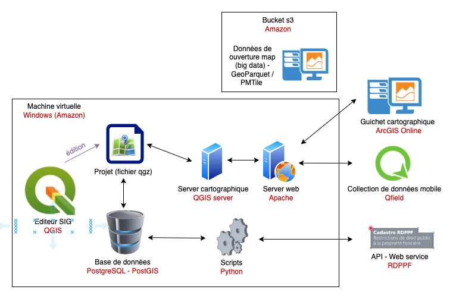

# Module S2  - SIT systèmes (webGIS et réseaux) 

Ce cours explore l’architecture et l’intégration des Systèmes d’Information Géographique (SIG) avec des infrastructures web et cloud. Il met l’accent sur la gestion, la publication et l’exploitation de données géospatiales à l’aide d’outils comme QGIS, PostgreSQL/PostGIS, QGIS Server, Apache, et l’interaction avec des plateformes externes telles qu’ArcGIS Online, QField et des services web (API RDPFF).

Les participants apprendront à :  
- Configurer et administrer un **serveur cartographique** (QGIS Server, Apache).  
- Manipuler et stocker des données spatiales dans une **base de données PostGIS**.  
- Automatiser les traitements géospatiaux avec des **scripts Python**.  
- Publier des cartes interactives et gérer des flux de **big data (GeoParquet, PMTiles) sur Amazon S3**.  
- Intégrer des solutions mobiles et des API pour la collecte et la diffusion de données géographiques.  

Ce module combine théorie et **applications pratiques** pour offrir une **compréhension complète** du déploiement d’une infrastructure WebSIG dans un **environnement cloud et open-source**.

## Planning

Ce document présente le planning provisoire du module SIT systèmes (webGIS et réseaux), organisé dans le cadre du Centre de formation géomatique suisse (Romandie). Il détaille les sessions de formation prévues, avec les thématiques abordées, les horaires, les enseignants, ainsi que les formats d'enseignement (présentiel ou en ligne).

Ce programme est sujet à d'éventuelles modifications en fonction des disponibilités et des ajustements pédagogiques nécessaires.

| Date                  | Lieu du cours | Horaire début | Horaire fin | Nbre de périodes | Enseignant-e | Thème                              | Slides |
|-----------------------|----------------|---------------|-------------|------------------|--------------|-------------------------------------|-------|
| mardi 3 juin 2025     |                | 08:30         | 10:00       | 2                | Régis        | Introduction                        | [lien](https://regislon.github.io/cfgeo_s2/general/README.html) |
|                       |                | 10:15         | 11:45       | 2                |              | Machines virtuelles                 | [lien](https://regislon.github.io/cfgeo_s2/machines_virtuelles/index.html) |
|                       |                | 13:00         | 14:30       | 2                |              | Github                              | [lien](https://regislon.github.io/cfgeo_s2/github/index.html) |
|                       |                | 14:45         | 16:15       | 2                |              | Base de données                     | [lien](https://regislon.github.io/cfgeo_s2/base_donnees/readme.html) |
| mardi 10 juin 2025    | Par Zoom       | 15:30         | 16:15       | 1                | Régis        | Base de données                     |       |
|                       |                | 16:30         | 17:15       | 1                |              | Base de données                     |       |
| mardi 17 juin 2025    |                | 08:30         | 10:00       | 2                | Lucie        | QGIS installation                   |       |
|                       |                | 10:15         | 11:45       | 2                |              | QGIS server                         |       |
|                       |                | 13:00         | 14:30       | 2                |              | Server web                          |       |
|                       |                | 14:45         | 16:15       | 2                |              | Théorie standard OGC (pptx)         |       |
| mardi 24 juin 2025    | Par Zoom       | 15:30         | 16:15       | 1                | Régis        | Base de données - Python            |       |
|                       |                | 16:30         | 18:00       | 2                |              | Python théorie                      |       |
| mardi 19 août 2025    |                | 08:30         | 10:00       | 2                | Régis        | Python                              |       |
|                       |                | 10:15         | 11:45       | 2                |              | Python                              |       |
|                       |                | 13:00         | 14:30       | 2                |              | Python                              |       |
|                       |                | 14:45         | 16:15       | 2                |              | Python                              |       |
| mardi 26 août 2025    | Par Zoom       | 15:30         | 16:15       | 1                | Régis        | Python                              |       |
|                       |                | 16:30         | 18:00       | 2                |              | Python                              |       |
| mardi 2 septembre 2025|                | 08:30         | 10:00       | 2                | Régis        | Python                              |       |
|                       |                | 10:15         | 11:45       | 2                |              | Python                              |       |
|                       |                | 13:00         | 14:30       | 2                |              | S3 + big data                       |       |
|                       |                | 14:45         | 16:15       | 2                |              | S3 + big data                       |       |
| mardi 9 septembre 2025|                | 08:30         | 10:00       | 2                | Lucie        | QGIS                                |       |
|                       |                | 10:15         | 11:45       | 2                |              | QGIS server                         |       |
|                       |                | 13:00         | 14:30       | 2                |              | Q field                             |       |
|                       |                | 14:45         | 16:15       | 2                |              | Eventuellement client web ???       |       |
| mardi 16 septembre 2025|               | 08:30         | 10:00       | 2                | Lucie        | QGIS                                |       |
|                       |                | 10:15         | 11:45       | 2                |              | QGIS server                         |       |
|                       |                | 13:00         | 14:30       | 2                | Eulalie      | AGOL                                |       |
|                       |                | 14:45         | 16:15       | 2                |              | AGOL                                |       |
| ?                     |                | 08:30         | 10:00       | 2                | ?            | S3 + big data                       |       |
|                       |                | 10:15         | 11:45       | 2                |              |                                     |       |
|                       |                | 13:00         | 14:30       | 2                |              |                                     |       |
|                       |                | 14:45         | 16:15       | 2                |              |                                     |       |

