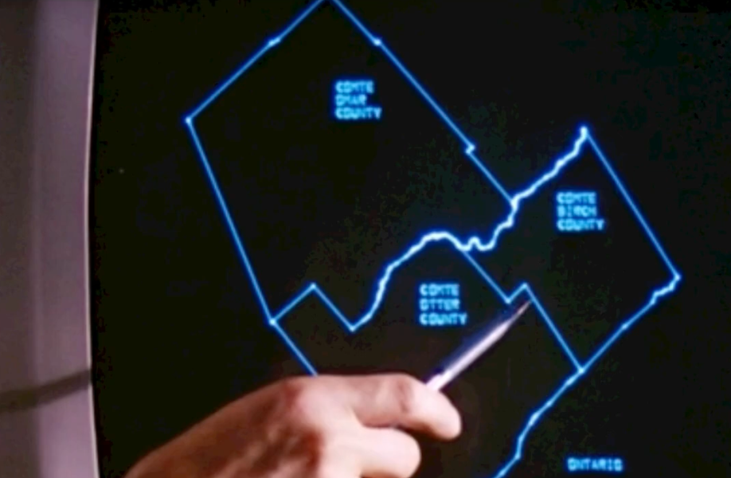
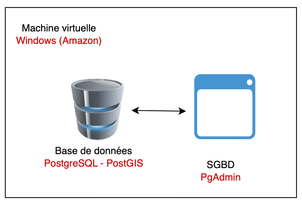
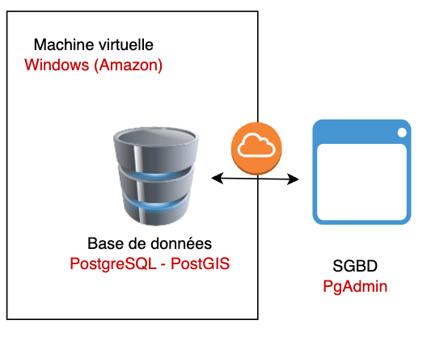

<style>
table th {
  font-size: 0.75em;
}
table td {
  font-size: 0.7em;
}
</style>

# Bases de données en géomatique

## PostgreSQL, PostGIS et fichiers géographiques

https://regislon.github.io/cfgeo_s2/base_donnees/

---



*Canada Land Inventory (CLI), which is often recognized as one of the first major GIS initiatives in the world*

---

## Pourquoi une base de données en géomatique ?

* Gérer de grands volumes de données spatiales
* Garantir l’intégrité, la cohérence et la traçabilité
* Faciliter les requêtes spatiales complexes
* Travailler en équipe, sur des données partagées

---

## Fichiers géographiques vs base de données

| Fichiers SIG (ex: Shapefile, GeoPackage)     | Base de données (PostGIS) |
| -------------------------------------------- | ------------------------- |
| Stockage local                               | Stockage centralisé       |
| Accès séquentiel                             | Requêtes dynamiques (SQL) |
| Limité pour la mise à jour multi-utilisateur | Collaboration simplifiée  |
| Pas d’index spatial performant               | Index spatial performant  |


---

La majorité de la diffusion des données géographiques s’effectue via des bases de données. Toutefois, les données statiques, pour des raisons de performance, sont souvent diffusées sous forme de fichiers tuilés, comme le format MBTiles, par exemple. 

De nouveaux formats, tels que GeoParquet, permettent désormais un enregistrement efficace et une accessibilité accrue sans nécessiter de base de données ni de serveur de diffusion. Nous y reviendrons plus en détail dans la suite du cours.

---

# Bases de données spatiales : panorama

## Les principaux SGBD spatiaux

* **PostgreSQL/PostGIS** : open source, très utilisé en géomatique, riche en fonctions spatiales.
* **Oracle Spatial** : solution propriétaire, très puissante, intégrée à Oracle Database.
* **Microsoft SQL Server (avec extension spatiale)** : supporte les types geometry et geography, utilisé dans de nombreux environnements professionnels.

---

* **MySQL (Spatial Extensions)** : supporte les objets géométriques, moins avancé que PostGIS ou Oracle.
* **SpatiaLite** : extension spatiale pour SQLite, idéale pour des usages légers ou embarqués.
* **MongoDB (GeoJSON)** : base NoSQL avec support des requêtes spatiales simples.

---

## Comparatif des coûts de licence (estimation)

| SGBD Spatial                | Licence / Coût estimé                |
|-----------------------------|--------------------------------------|
| PostgreSQL/PostGIS          | Gratuit (open source)                |
| Oracle Spatial              | $$$$ (plusieurs milliers €/an/util.) |
| SQL Server (édition Entreprise) | $$$ (plusieurs milliers €/an/serveur) |
| MySQL (Spatial Extensions)  | Gratuit (open source)                |
| SpatiaLite                  | Gratuit (open source)                |
| MongoDB (GeoJSON)           | Gratuit (open source, offre cloud payante) |

Quelle est la limite de votre carte de crédit ? 

---

## Historique de PostgreSQL

* **1986** : Début du projet POSTGRES à l’Université de Californie, Berkeley, sous la direction de Michael Stonebraker (suite au projet Ingres).
* **1996** : Le projet devient PostgreSQL, ajout du support SQL.
* **Années 2000** : Adoption croissante dans le monde open source et en entreprise, enrichissement des fonctionnalités (transactions, index avancés, extensibilité).
* **Aujourd’hui** : PostgreSQL est reconnu comme l’un des SGBD open source les plus robustes, évolutifs et riches en fonctionnalités, avec une forte communauté et de nombreux contributeurs.

---

## 😲 Fun facts

PostgreSQL se prononce souvent "Post-Gress", car le nom complet est un peu tordu pour beaucoup. C’est la contraction de POSTGRES (Post-Ingres) et SQL. Même les développeurs du projet disent que c’est OK de dire juste "Postgres".

🐘 Le logo de PostgreSQL est un éléphant- Pourquoi ? Parce qu’un éléphant a une excellente mémoire, tout comme une base de données fiable. Le logo s'appelle Slonik, et certains outils comme pgBackRest ou pgAdmin l’utilisent aussi.

---


## Historique de PostGIS

* **2001** : Début du développement de PostGIS par Refractions Research pour ajouter des capacités spatiales à PostgreSQL.
* **2003** : Première version stable (1.0), ajout des types `geometry` et des fonctions spatiales de base.
* **2005** : Certification OGC (Open Geospatial Consortium) pour la conformité avec les standards spatiaux.
* **Années 2010** : Intégration de nouvelles fonctionnalités comme le support des types `geography`, des index GiST améliorés, et des fonctions avancées (ST_Cluster, ST_3D).
* **Aujourd’hui** : PostGIS est l’une des extensions spatiales les plus utilisées, avec un large écosystème d’outils compatibles (QGIS, GeoServer, etc.).

---

**PostGIS & Spatial Database History**


https://www.youtube.com/watch?v=ZO5ZAXtW0MU


---

## PostgreSQL + PostGIS

* **PostgreSQL** : Système de gestion de base de données relationnelle (SGBDR)
* **PostGIS** : Extension spatiale de PostgreSQL

  * Ajoute le type `geometry` et `geography`
  * Fonctions spatiales : distances, intersections, buffers, etc.
  * Indexation spatiale avec **GiST**

---

## 😲 Fun facts


1. **PostGIS est conforme aux standards OGC**
   Cela veut dire qu’il respecte les règles internationales définies pour le traitement de données géographiques. Un must pour l’interopérabilité !

2. **Des fonctions spatiales à gogo**
   PostGIS propose plus de **600 fonctions** spatiales. Tu peux faire un `ST_Intersects`, `ST_Buffer`, `ST_Distance`, `ST_Within`, etc. C’est comme faire du QGIS dans une base de données.

3. **Utilisé par des agences spatiales ! 🚀**
   PostGIS est utilisé dans des projets de traitement de données **satellitaires**, par exemple à l’**ESA** (European Space Agency) ou dans des portails de données géographiques comme **GeoServer**.

---


4. **Il peut gérer le monde entier**
   Grâce à son support de projections multiples et de géométries complexes, PostGIS peut stocker et analyser des données à l’échelle **globale**, tout en étant rapide et efficace.

5. **Il a un plugin pour la 3D et le raster !**
   PostGIS ne se limite pas aux vecteurs : tu peux stocker et manipuler des **surfaces 3D** (`TIN`, `PolyhedralSurface`) et des **images raster géoréférencées**. Tu peux même faire des calculs NDVI dans ta base !


---


## Le modèle relationnel + spatial

```sql
CREATE TABLE batiments (
  id SERIAL PRIMARY KEY,
  nom TEXT,
  geom GEOMETRY(POLYGON, 2056)
);
```

* Chaque ligne représente un **objet géographique**
* La colonne `geom` contient la **géométrie**
* Le SRID (ex: 2056) indique le **système de projection**

---

## Requêtes spatiales avec PostGIS

```sql
-- Rechercher tous les bâtiments dans une zone
SELECT * FROM batiments
WHERE ST_Within(geom, ST_GeomFromText('POLYGON(...)', 2056));
```

* Requêtes puissantes grâce aux fonctions `ST_`
* Compatible avec QGIS, GeoServer, etc.

---

## Index spatial : accélérer les requêtes

```sql
CREATE INDEX batiments_geom_idx
ON batiments
USING GIST(geom);
```

* L’index GiST permet des recherches rapides
* Obligatoire pour les projets de grande envergure

---

## Intégration SIG + BDD

* QGIS peut se connecter directement à PostGIS
* Possibilité d’éditer, visualiser et filtrer les données
* Un seul lieu de vérité pour toutes les équipes

---

**Qgis est-il le seul à pouvoir se connecter à PostGIS ?**

Non, d'autres outils comme Pgadmin, GeoServer, MapServer, et même des langages de programmation comme Python (avec psycopg2) ou R (avec RPostgreSQL) peuvent se connecter à PostGIS.

---

## Qu'est-ce que PgAdmin ?

PgAdmin est un outil graphique open source pour gérer et administrer les bases de données PostgreSQL. Il offre une interface utilisateur intuitive pour :

* Créer, modifier et supprimer des bases de données, tables, et autres objets.
* Exécuter des requêtes SQL et visualiser les résultats.
* Gérer les utilisateurs et les permissions.
* Superviser les performances et surveiller l'activité de la base de données.


⚠️ : PgAdmin n'est pas une base de données, mais un SGBD.


---


## Résumé

* PostGIS transforme PostgreSQL en base spatiale puissante
* Idéal pour des projets collaboratifs et évolutifs
* Remplace avantageusement les fichiers plats (shapefile, etc.)
* Outil central dans une **Infrastructure de Données Spatiales (IDS)**

---
## Installation de PostgreSQL/PostGIS + PGAdmin

🛠️ Exercice : Installation de la base de données
📋 Instructions : à consulter ci-dessous
⏱️ Durée estimée : 20 minutes

---
## Procédure d'installation de PostgreSQL, PostGIS et PgAdmin

### 1. Installation de PostgreSQL
1. Rendez-vous sur le site officiel de PostgreSQL : [https://www.postgresql.org/download/](https://www.postgresql.org/download/).
2. Sélectionnez votre système d'exploitation (Windows).
3. Téléchargez et installez le programme d'installation approprié.
  - Configurez un mot de passe pour l'utilisateur `postgres`.
  - Notez le port par défaut (5432) et le chemin d'installation.


📺 **Consultez la vidéo d'installation `base_donnees/video/install.mkv` si nécessaire.**


---

### 3. Installation de PgAdmin
1. Téléchargez PgAdmin depuis [https://www.pgadmin.org/download/](https://www.pgadmin.org/download/).
2. Installez le logiciel en suivant les instructions pour votre système d'exploitation.
3. Lancez PgAdmin et connectez-vous à votre instance PostgreSQL en utilisant les informations configurées lors de l'installation.


---

### 2. Installation de PostGIS


Depuis PgAdmin, dans le menu **Tools > Query Tool**, exécutez les commandes suivantes :

1. Installez PostGIS via l'outil de gestion des extensions :
  ```sql
  CREATE EXTENSION postgis;
  ```
2. Vérifiez que PostGIS est bien installé :
  ```sql
  SELECT PostGIS_Full_Version();
  ```


---


Vouse êtres maintenant prêt à utiliser PostgreSQL et PostGIS depuis votre marchine virtuelle. 



---

Cependant, il arrive que la machine virtuelle soit relativement lente. Dans ce cas, il peut être plus simple de travailler directement sur votre propre ordinateur.



---


**Préparez-vous, car quelques configurations seront nécessaires si vous souhaitez accéder à la base à distance :**

* Il faudra configurer **PostgreSQL** pour qu’il accepte les connexions distantes.
* Il faudra également modifier le **pare-feu de la machine virtuelle** pour autoriser les connexions sur le port **5432**.
* Enfin, il sera nécessaire d’ajuster les **groupes de sécurité AWS** afin d’ouvrir ce même port.

👉 Ces étapes sont **optionnelles**, mais vous pouvez les suivre si vous souhaitez vous connecter à la base depuis votre propre ordinateur.


---


Pour ce faire, il vous suffit de suivre les étapes suivantes :
1. **Téléchargez et installez PgAdmin** sur votre PC personel.
2. **Ouvrir les ports de la machine virtuelle** pour permettre l'accès à PostgreSQL depuis l'extérieur (voir ci-après).
3. **Connectez-vous à la machine virtuelle** depuis PgAdmin en utilisant l'adresse IP de la VM et le port 5432.
4. **Créez une nouvelle connexion** dans PgAdmin en utilisant l'adresse IP de la VM, le port 5432, le nom d'utilisateur `postgres` et le mot de passe que vous avez défini lors de l'installation.
5. **Testez la connexion** pour vous assurer que tout fonctionne correctement.


---
## Ouverture des ports de la machine virtuelle depuis la console AWS

📺 **Consultez la vidéo d'installation `base_donnees/video/aws_security.mkv` si nécessaire.**

1. Connectez-vous à votre console AWS.
2. Accédez à la section **EC2**.
3. Sélectionnez votre instance EC2.
4. Cliquez sur l'onglet **Security Groups**.
5. Cliquez sur le groupe de sécurité associé à votre instance.
6. Cliquez sur l'onglet **Inbound rules**.
7. Cliquez sur **Edit inbound rules**.
8. Cliquez sur **Add rule**.

---

9. Sélectionnez **PostgreSQL** dans le menu déroulant.
10. Vérifiez que le port 5432 est sélectionné.
11. Dans le champ **Source**, sélectionnez **My IP** pour autoriser uniquement votre adresse IP ou **Anywhere** pour autoriser toutes les adresses IP (moins sécurisé).
12. Cliquez sur **Save rules** pour enregistrer les modifications.
13. Attendez quelques secondes pour que les modifications prennent effet.
14. Testez la connexion depuis PgAdmin en utilisant l'adresse IP publique (Public IPv4 DNS) de votre instance EC2 et le port 5432.


---


### ✅ Ouvrir le port 5432 pour PostgreSQL sur Windows Server 2022 (interface en anglais)

1. **Ouvrir le pare-feu**

   * Clique sur le menu **Start**, puis cherche **"Windows Defender Firewall with Advanced Security"** et ouvre-le.

2. **Créer une nouvelle règle entrante**

   * Dans le panneau de gauche, clique sur **Inbound Rules**.
   * Dans le panneau de droite, clique sur **New Rule…**.

3. **Choisir le type de règle**

   * Sélectionne **Port** puis clique sur **Next**.

---

4. **Configurer le port**

   * Choisis **TCP**.
   * Coche **Specific local ports** et saisis : `5432`
   * Clique sur **Next**.

5. **Définir l’action**

   * Sélectionne **Allow the connection**.
   * Clique sur **Next**.

6. **Choisir les profils**

   * Coche les options appropriées : **Domain**, **Private** et éventuellement **Public** si nécessaire.
   * Clique sur **Next**.

---

7. **Nommer la règle**

   * Donne un nom clair, comme : `PostgreSQL - Port 5432`
   * Clique sur **Finish**.


---

### 🔧 Configuration de PostgreSQL sur Windows Server 2022

* 📁 **Accéder au dossier d'installation** :
  `C:\Program Files\PostgreSQL\17\data\`


* 📝 **Modifier `pg_hba.conf`** :

  * Ouvrir également avec Notepad en mode administrateur.
  * Ajouter à la fin :
    `host    all    all    0.0.0.0/0    md5`


* 🔁 **Redémarrer le service PostgreSQL** :

  * Lancer `services.msc`
  * Trouver `postgresql-x64-<version>`
  * Clic droit → **Restart**


---


### 5. Ressources supplémentaires
- Documentation PostgreSQL : [https://www.postgresql.org/docs/](https://www.postgresql.org/docs/)
- Documentation PostGIS : [https://postgis.net/documentation/](https://postgis.net/documentation/)
- Tutoriels PgAdmin : [https://www.pgadmin.org/docs/](https://www.pgadmin.org/docs/)

---


