<style>
table th {
  font-size: 0.75em;
}
table td {
  font-size: 0.7em;
}
</style>

# Bases de données en géomatique

## PostgreSQL, PostGIS et fichiers géographiques

- Doc : [https://github.com/regislon/cfgeo_s2/tree/main/base_donnees](https://github.com/regislon/cfgeo_s2/tree/main/base_donnees)
- Slides : [https://regislon.github.io/cfgeo_s2/base_donnees/index.html](https://regislon.github.io/cfgeo_s2/base_donnees/index.html)


---


L’**Inventaire des terres du Canada** (*Canada Land Inventory*, CLI) est souvent reconnu comme l’une des premières grandes initiatives de SIG  au monde. Ce projet, lancé dans les années 1960, visait à cartographier et à évaluer l’utilisation potentielle des terres à l’échelle nationale, en intégrant de vastes ensembles de données spatiales pour soutenir la gestion des ressources naturelles et l’aménagement du territoire.

---

## Table des matières


- [Partie 1 : Théorie](#partie-1--théorie)
- [Partie 2 : Installation de PostgreSQL/PostGIS + PGAdmin](#partie-2--installation-de-postgresqlpostgis--pgadmin)
- [Partie 3 : Création d'une base de données géographique et ajout d'une table - Pratique](#partie-3--création-dune-base-de-données-géographique-et-ajout-dune-table---pratique)
- [Partie 4 : Accès à la base de données depuis votre ordinateur personnel](#partie-4--accès-à-la-base-de-données-depuis-votre-ordinateur-personnel)
- [Partie 5 : Partie théorique, concepts avancés](#partie-5--partie-théorique-concepts-avancés)
- [Ressources supplémentaires](#5-ressources-supplémentaires)


---


# Partie 1 : Théorie


---

## Pourquoi une base de données en géomatique ?

- Gérer de grands volumes de données spatiales
- Garantir l’intégrité, la cohérence et la traçabilité
- Faciliter les requêtes spatiales complexes
- Travailler en équipe, sur des données partagées

---

## Fichiers géographiques vs base de données

| Fichiers SIG (ex: Shapefile, GeoPackage)     | Base de données (PostGIS) |
| -------------------------------------------- | ------------------------- |
| Stockage local                               | Stockage centralisé       |
| Accès séquentiel                             | Requêtes dynamiques (SQL) |
| Limité pour la mise à jour multi-utilisateur | Collaboration simplifiée  |
| Pas d’index spatial performant               | Index spatial performant  |


---

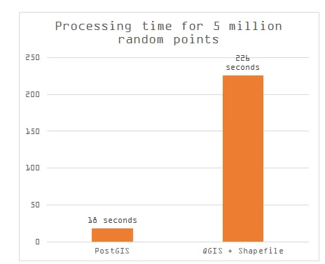

source : [https://medium.com/@tjukanov/why-should-you-care-about-postgis-a-gentle-introduction-to-spatial-databases-9eccd26bc42b](https://medium.com/@tjukanov/why-should-you-care-about-postgis-a-gentle-introduction-to-spatial-databases-9eccd26bc42b)

---

La majorité de la diffusion des données géographiques s’effectue via des bases de données. Toutefois, les données statiques, pour des raisons de performance, sont souvent diffusées sous forme de fichiers tuilés, comme le format MBTiles, par exemple. 

De nouveaux formats, tels que GeoParquet, permettent désormais un enregistrement efficace et une accessibilité accrue sans nécessiter de base de données ni de serveur de diffusion. Nous y reviendrons plus en détail dans la suite du cours.

---

## Les principaux SGBD spatiaux

- **PostgreSQL/PostGIS** : open source, très utilisé en géomatique, riche en fonctions spatiales.
- **Oracle Spatial** : solution propriétaire, très puissante, intégrée à Oracle Database.
- **Microsoft SQL Server (avec extension spatiale)** : supporte les types geometry et geography, utilisé dans de nombreux environnements professionnels.

---

- **MySQL (Spatial Extensions)** : supporte les objets géométriques, moins avancé que PostGIS ou Oracle.
- **SpatiaLite** : extension spatiale pour SQLite, idéale pour des usages légers ou embarqués.
- **MongoDB (GeoJSON)** : base NoSQL avec support des requêtes spatiales simples.

---

## Comparatif des coûts de licence (estimation)

| SGBD Spatial                | Licence / Coût estimé                |
|-----------------------------|--------------------------------------|
| PostgreSQL/PostGIS          | Gratuit (open source)                |
| Oracle Spatial              | $$$$ (plusieurs milliers €/an/util.) |
| SQL Server (édition Entreprise) | $$$ (plusieurs milliers €/an/serveur) |
| MySQL (Spatial Extensions)  | Gratuit (open source)                |
| SpatiaLite                  | Gratuit (open source)                |
| MongoDB (GeoJSON)           | Gratuit (open source, offre cloud payante) |

Quelle est la limite de votre carte de crédit ? 

---

## Historique de PostgreSQL

- **1986** : Début du projet POSTGRES à l’Université de Californie, Berkeley, sous la direction de Michael Stonebraker (suite au projet Ingres).
- **1996** : Le projet devient PostgreSQL, ajout du support SQL.
- **Années 2000** : Adoption croissante dans le monde open source et en entreprise, enrichissement des fonctionnalités (transactions, index avancés, extensibilité).
- **Aujourd’hui** : PostgreSQL est reconnu comme l’un des SGBD open source les plus robustes, évolutifs et riches en fonctionnalités, avec une forte communauté et de nombreux contributeurs.

---

## 😲 Fun facts

PostgreSQL se prononce souvent "Post-Gress", car le nom complet est un peu tordu pour beaucoup. C’est la contraction de POSTGRES (Post-Ingres) et SQL. Même les développeurs du projet disent que c’est OK de dire juste "Postgres".

🐘 Le logo de PostgreSQL est un éléphant- Pourquoi ? Parce qu’un éléphant a une excellente mémoire, tout comme une base de données fiable. Le logo s'appelle Slonik, et certains outils comme pgBackRest ou pgAdmin l’utilisent aussi.

---


## Historique de PostGIS

- **2001** : Début du développement de PostGIS par Refractions Research pour ajouter des capacités spatiales à PostgreSQL.
- **2003** : Première version stable (1.0), ajout des types `geometry` et des fonctions spatiales de base.
- **2005** : Certification OGC (Open Geospatial Consortium) pour la conformité avec les standards spatiaux.
- **Années 2010** : Intégration de nouvelles fonctionnalités comme le support des types `geography`, des index GiST améliorés, et des fonctions avancées (ST_Cluster, ST_3D).
- **Aujourd’hui** : PostGIS est l’une des extensions spatiales les plus utilisées, avec un large écosystème d’outils compatibles (QGIS, GeoServer, etc.).

---

**PostGIS & Spatial Database History**

https://www.youtube.com/watch?v=ZO5ZAXtW0MU


---

## PostgreSQL + PostGIS

- **PostgreSQL** : Système de gestion de base de données relationnelle (SGBDR)
- **PostGIS** : Extension spatiale de PostgreSQL

  - Ajoute le type `geometry` et `geography`
  - Fonctions spatiales : distances, intersections, buffers, etc.
  - Indexation spatiale avec **GiST**

---

## 😲 Fun facts


1. **PostGIS est conforme aux standards OGC**
   Cela veut dire qu’il respecte les règles internationales définies pour le traitement de données géographiques. Un must pour l’interopérabilité !

2. **Des fonctions spatiales à gogo**
   PostGIS propose plus de **600 fonctions** spatiales. Tu peux faire un `ST_Intersects`, `ST_Buffer`, `ST_Distance`, `ST_Within`, etc. C’est comme faire du QGIS dans une base de données.

3. **Utilisé par des agences spatiales ! 🚀**
   PostGIS est utilisé dans des projets de traitement de données **satellitaires**, par exemple à l’**ESA** (European Space Agency) ou dans des portails de données géographiques comme **GeoServer**.

---

4. **Il peut gérer le monde entier**
   Grâce à son support de projections multiples et de géométries complexes, PostGIS peut stocker et analyser des données à l’échelle **globale**, tout en étant rapide et efficace.

5. **Il a un plugin pour la 3D et le raster !**
   PostGIS ne se limite pas aux vecteurs : tu peux stocker et manipuler des **surfaces 3D** (`TIN`, `PolyhedralSurface`) et des **images raster géoréférencées**. Tu peux même faire des calculs NDVI dans ta base !


---


## Le modèle relationnel + spatial

```sql
CREATE TABLE batiments (
  id SERIAL PRIMARY KEY,
  nom TEXT,
  geom GEOMETRY(POLYGON, 2056)
);
```

- Chaque ligne représente un **objet géographique**
- La colonne `geom` contient la **géométrie**
- Le SRID (ex: 2056) indique le **système de projection**

---

## Requêtes spatiales avec PostGIS

```sql
-- Rechercher tous les bâtiments dans une zone
SELECT * FROM batiments
WHERE ST_Within(geom, ST_GeomFromText('POLYGON(...)', 2056));
```

- Requêtes puissantes grâce aux fonctions `ST_`
- Compatible avec QGIS, GeoServer, etc.

---

## Index spatial : accélérer les requêtes

```sql
CREATE INDEX batiments_geom_idx
ON batiments
USING GIST(geom);
```

- L’index GiST permet des recherches rapides
- Obligatoire pour les projets de grande envergure

---

## Intégration SIG + BDD

- QGIS peut se connecter directement à PostGIS
- Possibilité d’éditer, visualiser et filtrer les données
- Un seul lieu de vérité pour toutes les équipes

---

**Qgis est-il le seul à pouvoir se connecter à PostGIS ?**

Non, d'autres outils comme Pgadmin, GeoServer, MapServer, et même des langages de programmation comme Python (avec psycopg2) ou R (avec RPostgreSQL) peuvent se connecter à PostGIS.

---

## Qu'est-ce que PgAdmin ?

PgAdmin est un outil graphique open source pour gérer et administrer les bases de données PostgreSQL. Il offre une interface utilisateur intuitive pour :

- Créer, modifier et supprimer des bases de données, tables, et autres objets.
- Exécuter des requêtes SQL et visualiser les résultats.
- Gérer les utilisateurs et les permissions.
- Superviser les performances et surveiller l'activité de la base de données.


⚠️ : PgAdmin n'est pas une base de données, mais un outil graphique pour adminsiter la base de données.


---


## Résumé

- PostGIS transforme PostgreSQL en base spatiale puissante
- Idéal pour des projets collaboratifs et évolutifs
- Remplace avantageusement les fichiers plats (shapefile, etc.)
- Outil central dans une **Infrastructure de Données Spatiales (IDS)**


---
## Let's go !!!!


---

# Partie 2 : Installation de PostgreSQL/PostGIS + PGAdmin

---
## Installation de PostgreSQL/PostGIS + PGAdmin

🛠️ Exercice : Installation de la base de données sur votre machine virtuelle
📋 Instructions : à consulter ci-après
⏱️ Durée estimée : 20 minutes

---
## Procédure d'installation de PostgreSQL, PostGIS et PgAdmin

### 1. Installation de PostgreSQL
1. Rendez-vous sur le site officiel de PostgreSQL : [https://www.postgresql.org/download/](https://www.postgresql.org/download/).
2. Sélectionnez votre système d'exploitation (Windows).
3. Téléchargez et installez le programme d'installation approprié.
  - Configurez un mot de passe pour l'utilisateur `postgres`.
  - Notez le port par défaut (5432) et le chemin d'installation.


📺 **Consultez la vidéo d'installation `base_donnees/video/install.mkv` si nécessaire.**


---

### 3. Installation de PgAdmin
1. Téléchargez PgAdmin depuis [https://www.pgadmin.org/download/](https://www.pgadmin.org/download/).
2. Installez le logiciel en suivant les instructions pour votre système d'exploitation.
3. Lancez PgAdmin et connectez-vous à votre instance PostgreSQL en utilisant les informations configurées lors de l'installation.


---

### 2. Installation de PostGIS


Depuis PgAdmin, dans le menu **Tools > Query Tool**, exécutez les commandes suivantes :

1. Installez PostGIS via l'outil de gestion des extensions :
  ```sql
  CREATE EXTENSION postgis;
  ```
2. Vérifiez que PostGIS est bien installé :
  ```sql
  SELECT PostGIS_Full_Version();
  ```


---


Vouse êtes maintenant prêt à utiliser PostgreSQL et PostGIS depuis votre marchine virtuelle. 


---

Cependant, il arrive que la machine virtuelle soit relativement lente. Dans ce cas, il peut être plus simple de travailler directement sur votre propre ordinateur. Mais nous verrons cela plus tard...


---


1. Depuis PgAdmin. Clic droit sur Bases de données => Ajouter...
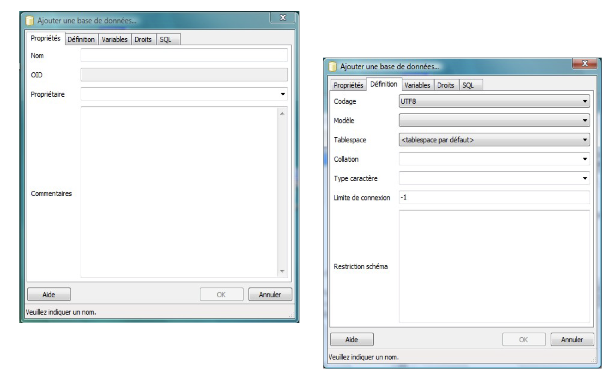

---

2. variante 1 :  A l’aide du wizard
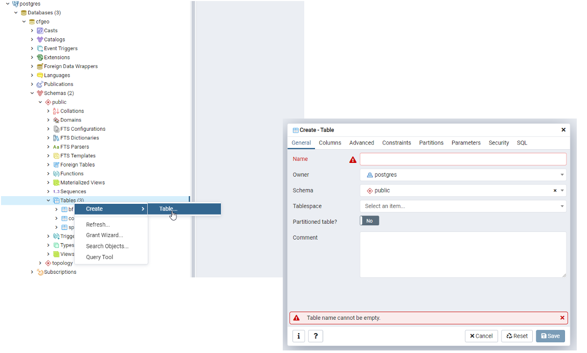


---

2. variante 2 : En SQL 

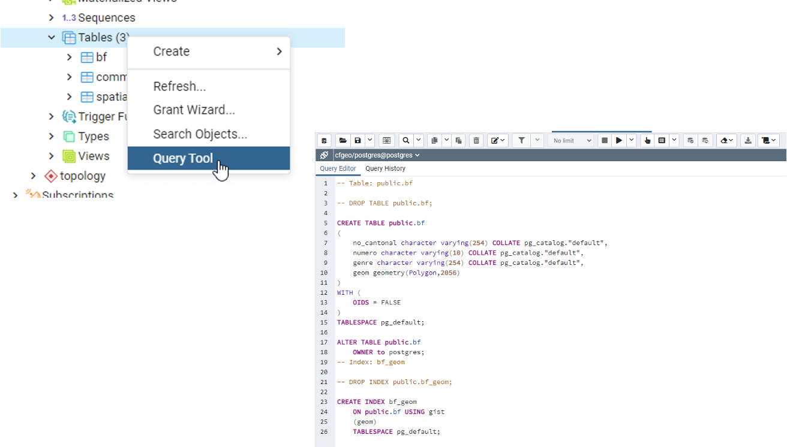

(mieux pour ajouter la géométrie)

---

# Partie 3 : Création d'une base de données géographique et ajout d'une table - Pratique

---


## Créer une base de données géographique et ajoute d'une table

🛠️ Exercice : nous allons créer une nouvelle base de données et ajouter une table avec différentes géométries
📋 Instructions : à consulter ci-après
⏱️ Durée estimée : 5 minutes


---

1. Exécuter la requête SQL suivante dans PgAdmin pour créer une nouvelle table.

```sql
CREATE TABLE geometries (name varchar, geom geometry);

INSERT INTO geometries VALUES
  ('Point', 'POINT(0 0)'),
  ('Linestring', 'LINESTRING(0 0, 1 1, 2 1, 2 2)'),
  ('Polygon', 'POLYGON((0 0, 1 0, 1 1, 0 1, 0 0))'),
  ('PolygonWithHole', 'POLYGON((0 0, 10 0, 10 10, 0 10, 0 0),(1 1, 1 2, 2 2, 2 1, 1 1))'),
  ('Collection', 'GEOMETRYCOLLECTION(POINT(2 0),POLYGON((0 0, 1 0, 1 1, 0 1, 0 0)))’);

```

2. visualiser cette table 

---

3. Puis exécuter la requête suivante pour visualiser les géométries dans QGIS :

```sql 
SELECT name, ST_AsText(geom) FROM geometries;
```

Que obtenez-vous ?


---
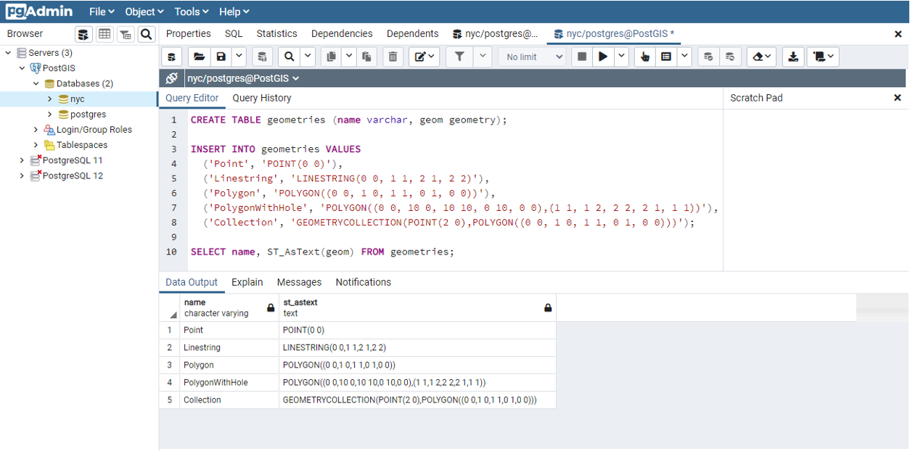

---

# Partie 4 : Accès à la base de données depuis votre ordinateur personnel

Situation actuelle :

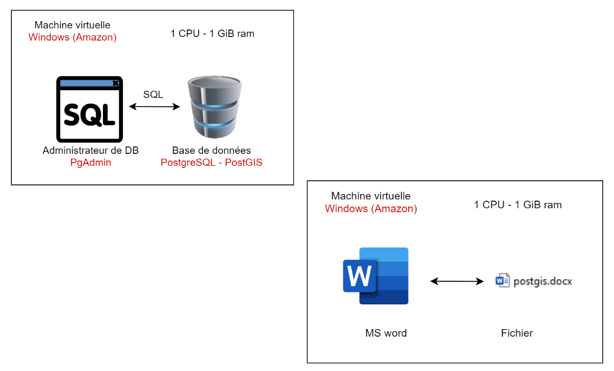

---

Il est possible d’accéder à la base de données PostgreSQL/PostGIS depuis votre ordinateur personnel, en utilisant un outil comme **PgAdmin**. Cela vous permet de gérer vos données géographiques sans avoir à vous connecter à la machine virtuelle à chaque fois.

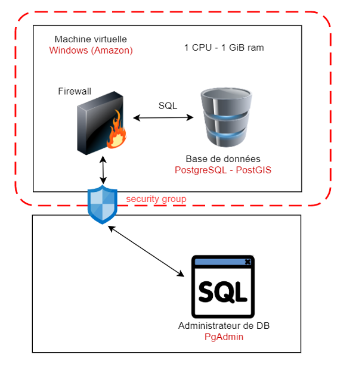


---


**Préparez-vous, car quelques configurations seront nécessaires si vous souhaitez accéder à la base à distance :**

- Il faudra configurer **PostgreSQL** pour qu’il accepte les connexions distantes.
- Il faudra également modifier le **pare-feu de la machine virtuelle** pour autoriser les connexions sur le port **5432**.
- Enfin, il sera nécessaire d’ajuster les **groupes de sécurité AWS** afin d’ouvrir ce même port.


---


Pour ce faire, il vous suffit de suivre les étapes suivantes :
1. **Téléchargez et installez PgAdmin** sur votre PC personel.
2. **Ouvrir les ports de la machine virtuelle** pour permettre l'accès à PostgreSQL depuis l'extérieur (voir ci-après).
3. **Connectez-vous à la machine virtuelle** depuis PgAdmin en utilisant l'adresse IP de la VM et le port 5432.
4. **Créez une nouvelle connexion** dans PgAdmin en utilisant l'adresse IP de la VM, le port 5432, le nom d'utilisateur `postgres` et le mot de passe que vous avez défini lors de l'installation.
5. **Testez la connexion** pour vous assurer que tout fonctionne correctement.

---

## Installer PgAdmin sur votre ordinateur personnel

🛠️ Exercice : Installer PgAdmin sur votre ordinateur personnel
📋 Instructions : voir procédure pour le machine virtuelle
⏱️ Durée estimée : 5 minutes


---
## Ouverture des ports de la machine virtuelle depuis la console AWS

📺 **Consultez la vidéo d'installation `base_donnees/video/aws_security.mkv` si nécessaire.**

1. Connectez-vous à votre console AWS.
2. Accédez à la section **EC2**.
3. Sélectionnez votre instance EC2.
4. Cliquez sur l'onglet **Security Groups**.
5. Cliquez sur le groupe de sécurité associé à votre instance.
6. Cliquez sur l'onglet **Inbound rules**.
7. Cliquez sur **Edit inbound rules**.
8. Cliquez sur **Add rule**.

---

9. Sélectionnez **PostgreSQL** dans le menu déroulant.
10. Vérifiez que le port 5432 est sélectionné.
11. Dans le champ **Source**, sélectionnez **My IP** pour autoriser uniquement votre adresse IP ou **Anywhere** pour autoriser toutes les adresses IP (moins sécurisé).
12. Cliquez sur **Save rules** pour enregistrer les modifications.
13. Attendez quelques secondes pour que les modifications prennent effet.
14. Testez la connexion depuis PgAdmin en utilisant l'adresse IP publique (Public IPv4 DNS) de votre instance EC2 et le port 5432.


---


## ✅ Ouvrir le port 5432 pour PostgreSQL sur Windows Server 2022 (interface en anglais)

1. **Ouvrir le pare-feu**

   - Clique sur le menu **Start**, puis cherche **"Windows Defender Firewall with Advanced Security"** et ouvre-le.

2. **Créer une nouvelle règle entrante**

   - Dans le panneau de gauche, clique sur **Inbound Rules**.
   - Dans le panneau de droite, clique sur **New Rule…**.

3. **Choisir le type de règle**

   - Sélectionne **Port** puis clique sur **Next**.

---

4. **Configurer le port**

   - Choisis **TCP**.
   - Coche **Specific local ports** et saisis : `5432`
   - Clique sur **Next**.

5. **Définir l’action**

   - Sélectionne **Allow the connection**.
   - Clique sur **Next**.

6. **Choisir les profils**

   - Coche les options appropriées : **Domain**, **Private** et éventuellement **Public** si nécessaire.
   - Clique sur **Next**.

---

7. **Nommer la règle**

   - Donne un nom clair, comme : `PostgreSQL - Port 5432`
   - Clique sur **Finish**.


---

### 🔧 Configuration de PostgreSQL sur Windows Server 2022

- 📁 **Accéder au dossier d'installation** :
  `C:\Program Files\PostgreSQL\17\data\`


- 📝 **Modifier `pg_hba.conf`** :

  - Ouvrir également avec Notepad en mode administrateur.
  - Ajouter à la fin :
    `host    all    all    0.0.0.0/0    md5`


- 🔁 **Redémarrer le service PostgreSQL** :

  - Lancer `services.msc`
  - Trouver `postgresql-x64-<version>`
  - Clic droit → **Restart**


---

# Partie 5 : Partie théorique, concepts avancés

---

## Partie 5 : Concepts avancés — Panorama

Dans cette partie, nous allons approfondir les concepts clés des bases de données spatiales :

- **Types de géométrie** : points, lignes, polygones, collections, 3D, etc.
- **Indexation spatiale** : accélérer les requêtes grâce aux index (GiST, R-Tree).
- **Requêtes spatiales** : sélection, mesure, relations spatiales (intersection, inclusion, distance…).
- **Jointures spatiales** : relier des tables selon la position ou la relation géographique de leurs objets.
- **Systèmes de coordonnées** : importance du SRID et des projections pour la précision des calculs.


---

Les base de données spatiales fournissent de nouveaux types de données afin de modéliser les géométries

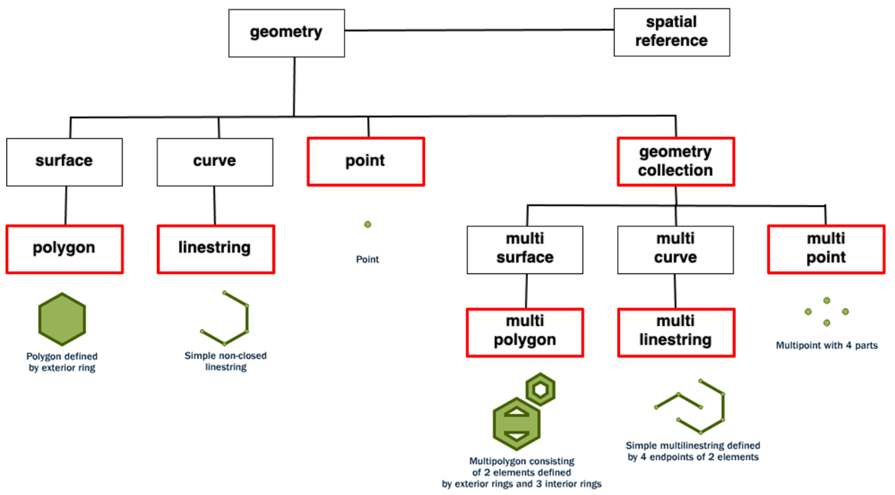


---

Les base de données spatiales ont des index spatiaux

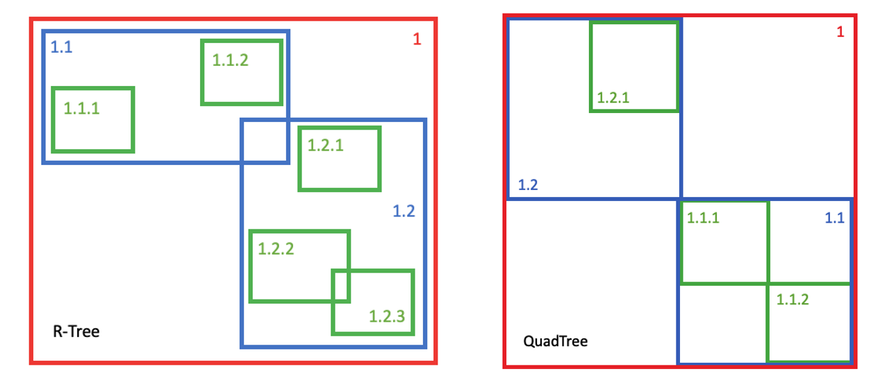

```sql
CREATE INDEX mytable_geom ON mytable USING GIST (geom);
```

---

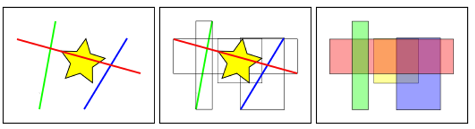

Dans la figure ci-dessus, le nombre de lignes qui coupent l'étoile jaune est de un, la ligne rouge. Mais les boîtes englobantes des éléments qui coupent la boîte jaune sont au nombre de deux, la rouge et la bleue.

La façon dont la base de données répond efficacement à la question "quelles lignes coupent l'étoile jaune" est de répondre d'abord à la question "quelles boîtes coupent la boîte jaune" en utilisant l'index (ce qui est très rapide), puis de faire un calcul exact de "quelles lignes coupent l'étoile jaune" uniquement pour les objets retournés par le premier test.

---

Pour une grande table, ce système de "deux passes" consistant à évaluer d'abord l'index approximatif, puis à effectuer un test exact peut réduire radicalement la quantité de calculs nécessaires pour répondre à une requête.


---

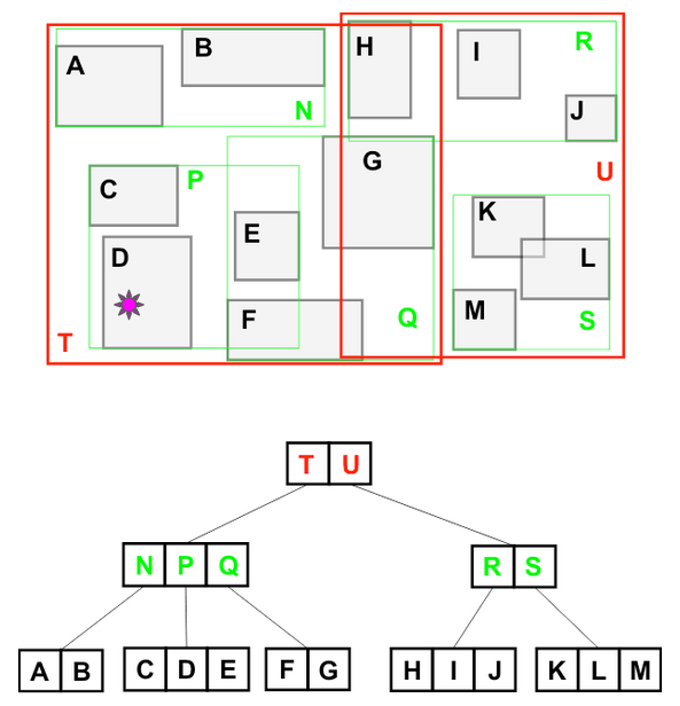


Ce **R-Tree** organise les objets spatiaux de manière à ce qu’une recherche spatiale soit une promenade rapide dans l’arbre.

Pour trouver quel objet contient 🌸 :

- Le système vérifie d’abord s’il est dans **T** ou **U** (**T**).
- Il vérifie ensuite s’il se trouve dans **N**, **P** ou **Q** (**P**).
- Il vérifie enfin s’il se trouve dans **C**, **D** ou **E** (**D**).

Seulement **8 cases** doivent être testées.
Pour un balayage complet de la table, il faudrait tester **13 cases**.
Plus la table est grande, plus l’index est **puissant**.

---


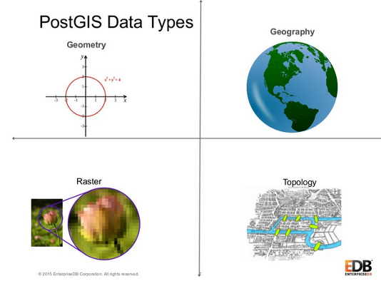

POSTGIS offre quatre types spatiaux principaux
- Geometry : type planaire basé sur les mathématiques cartésiennes (éléments : points, lignes, polygones, ...).
- Geography : type géodésique sphéroïdal (des lignes et des polygones sont dessinés sur une surface courbe).
- Topology : type de modèle relationnel. Les objets sont représentés comme un réseau de nœuds et d'arêtes.
- Raster : l'espace est modélisé comme une grille de cellules rectangulaires, chacune contenant une valeur numérique


---

### Points 


```sql
CREATE TABLE myPoints (
   id SERIAL PRIMARY KEY,
   description VARCHAR(10),
   point GEOMETRY(POINT),
   3dpoint GEOMETRY(POINTZ),
   pointsrd GEOMETRY(POINT, 4326)
);

```


- **POINT** → un point dans l’espace 2D avec des coordonnées (X,Y)
- **POINTZ** → un point dans l’espace 3D avec des coordonnées (X,Y,Z)
- **POINTM** → un point dans l’espace 2D avec une valeur mesurée (M)
- **POINTZM** → un point dans l’espace 3D avec une valeur mesurée (M)

---

### Lignes / Polygones


```sql
CREATE TABLE geometries (name varchar, geom geometry);

INSERT INTO geometries VALUES
  ('Point', 'POINT(0 0)'),
  ('Linestring', 'LINESTRING(0 0, 1 1, 2 1, 2 2)'),
  ('Polygon', 'POLYGON((0 0, 1 0, 1 1, 0 1, 0 0))'),
  ('PolygonWithHole', 'POLYGON((0 0, 10 0, 10 10, 0 10, 0 0),
                               (1 1, 1 2, 2 2, 2 1, 1 1))'),
  ('Collection', 'GEOMETRYCOLLECTION(POINT(2 0)),
                POLYGON((0 0, 1 0, 1 1, 0 1, 0 0)))');


```


- **LINESTRING** → une ligne composée de plusieurs points en 2D (coordonnées X,Y)
- **LINESTRINGZ** → une ligne en 3D (coordonnées X,Y,Z)

---


- **LINESTRINGM** → une ligne en 2D avec une valeur mesurée (M) à chaque point
- **LINESTRINGZM** → une ligne en 3D avec une valeur mesurée (M) à chaque point
- **POLYGON** → une surface fermée définie par un ou plusieurs anneaux en 2D
- **MULTIPOINT** → un ensemble de points indépendants
- **MULTIPOLYGON** → un ensemble de polygones distincts
- **GEOMETRYCOLLECTION** → une collection hétérogène de géométries (points, lignes, polygones, etc.)

---

### Autre types de géométrie

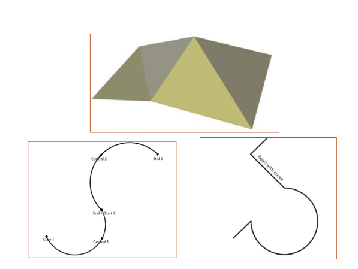


- **POLYHEDRALSURFACE** : surface 3D composée de plusieurs faces polygonales.
- **TIN** : réseau de triangles pour modéliser des surfaces irrégulières (topographie).
- **CIRCULARSTRING** : courbe définie par des arcs de cercle.
- **COMPOUNDCURVE** : combinaison de segments linéaires et de courbes.
- **CURVEPOLYGON** : polygone dont les bords peuvent être des courbes.


---


### ✅ Fonctions de construction de géométries :

* **ST\_GeomFromText** → Build geometries from well-known text
* **ST\_GeomFromWKB** → Build geometries from a binary representation
* **ST\_GeomFromGeoJSON** → Build geometries from a GEOJSON format
* **ST\_GeomFromKML** → Build geometries from a KML format

---

### ✅ Exemple SQL :

```sql
CREATE TABLE cities (
  id int4 primary key,
  name varchar(50),
  the_geom geometry(POINT, 4326)
);

INSERT INTO cities (id, the_geom, name) VALUES
  (1, ST_GeomFromText('POINT(-0.1257 51.508)', 4326), 'London, England'),
  (2, ST_GeomFromText('POINT(-81.233 42.983)', 4326), 'London, Ontario'),
  (3, ST_GeomFromText('POINT(27.91162491 -33.01529)', 4326), 'East London, SA');
```

---


### ✅ Requête de sélection :

```sql
SELECT * FROM cities;
```

Résultat :

```
 id |       name        |                      the_geom
----+-------------------+--------------------------------------------------------------
 1  | London, England   | 0101000020E6100000BBB88D06F016C0BF1B2FDD2406C14940
 2  | London, Ontario   | 0101000020E6100000F4FDD478E94E54C0E7FBA9F1D27D4540
 3  | East London, SA   | 0101000020E610000040AB064060E93B4059FAD005F58140C0
```


🔲 **Remarque importante** :
La colonne `the_geom` affiche une **représentation binaire spatiale** (WKB : Well-Known Binary).


---
### Charger des données dans postgreSQL


🛠️ Exercice : Charger des données que nous allons utiliser par la suite
📋 Instructions : à consulter ci-après
⏱️ Durée estimée : 20 minutes

Fichier à télécharger : [https://github.com/regislon/cfgeo_s2/tree/main/base_donnees/dump.sql](https://github.com/regislon/cfgeo_s2/tree/main/base_donnees/dump.sql)


---

Marche à suivre pour charger les données dans PostgreSQL :
1. Ouvrir PgAdmin et se connecter à la base de données créée précédemment.
2. Ouvrir l'outil de requête SQL (Query Tool).
3. Copier le contenu du fichier `dump.sql` dans l'outil de requête.
4. Exécuter la requête en cliquant sur le bouton "Exécuter" (icône en forme de triangle).

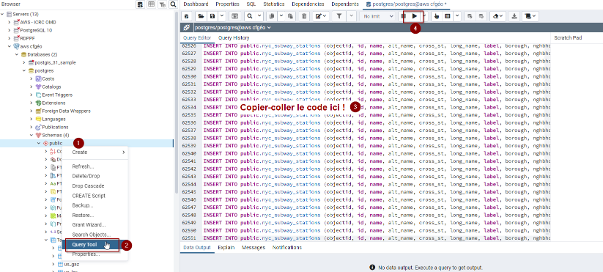

---

Contenu du fichier `dump.sql` : stations de métro de New York


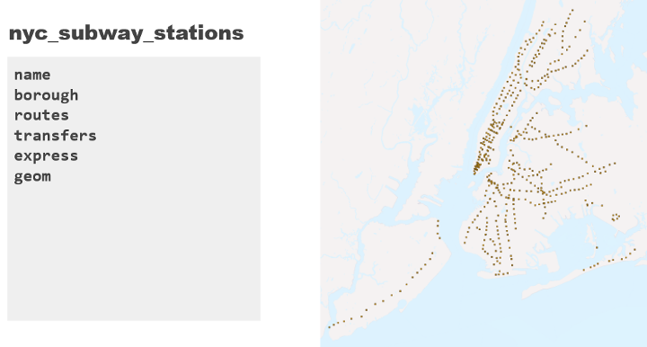


---

Contenu du fichier `dump.sql` : les rues de  New York

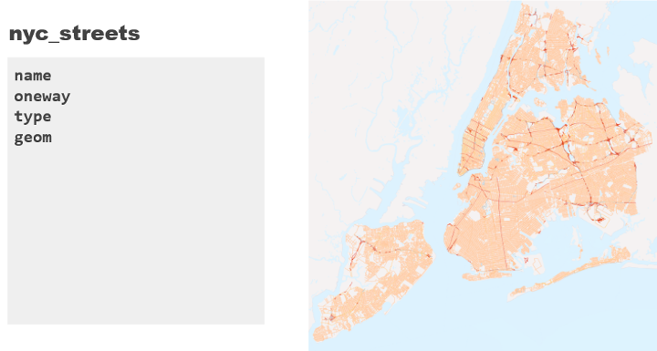

---
Contenu du fichier `dump.sql` : les blocs de recensement de New York

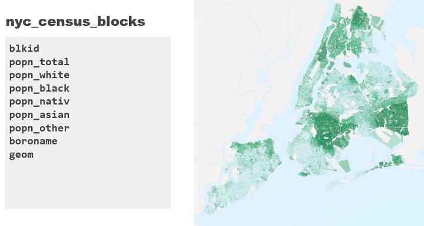


---

Contenu du fichier `dump.sql` : les quartiers  de  New York
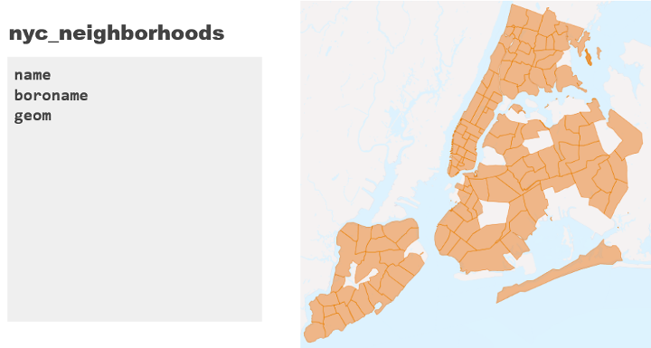


---

## Visualiser la géométrie dans PgAdmin

Depuis PgAdmin, il est possible de visualiser les géométries directement dans l'interface :

1. Faites un clic droit sur la table contenant la colonne géométrique, puis sélectionnez **View/Edit Data > All Rows**.
2. Dans la colonne `geom`, cliquez sur l'icône en forme de globe ou de loupe pour ouvrir le visualiseur de géométrie intégré.
3. Vous pouvez ainsi explorer et vérifier la représentation spatiale de vos données sans quitter PgAdmin.

Cette fonctionnalité est très pratique pour un contrôle rapide des objets spatiaux insérés ou modifiés dans la base.

---


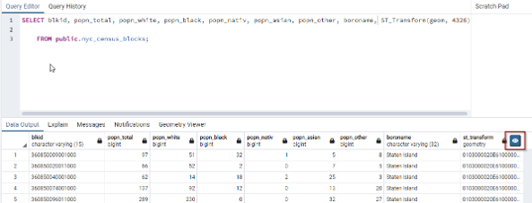

---

# Charger des données géographiques dans PostgreSQL

Plusieurs outils permettent d'importer des données spatiales dans PostgreSQL/PostGIS :

- **ogr2ogr** (GDAL) : conversion et import de nombreux formats (Shapefile, GeoJSON, etc.)
- **shp2pgsql** : conversion de Shapefile en SQL pour PostGIS
- **SQL** : insertion directe via requêtes SQL
- **Logiciels SIG** (QGIS, ArcGIS) : connexion et import/export de données
- **ETL** (FME, Talend) : flux de transformation et chargement avancés


---


Exemple avec `ogr2ogr` :

```bash
ogr2ogr \
   -f "PostgreSQL" \
   PG:"host=localhost dbname=nyc user=postgres password=secret" \
   nyc_census_blocks_2000.shp \
   -nln nyc_census_blocks_2000 \
   -lco GEOMETRY_NAME=geom \
   -lco FID=gid \
   -lco PRECISION=NO
```

- `-nln` : nom de la nouvelle table
- `-lco GEOMETRY_NAME` : nom de la colonne géométrique
- `-lco FID` : nom de la clé primaire
- `-lco PRECISION` : précision des coordonnées

Pour plus de détails, voir la [documentation GDAL/ogr2ogr](https://gdal.org/programs/ogr2ogr.html).

---


## Fonctions de conversion de géométrie dans PostGIS

| Catégorie         | Fonctions principales                                                                                 | Formats pris en charge                |
|-------------------|------------------------------------------------------------------------------------------------------|---------------------------------------|
| **Export (ST_As)**    | `ST_AsText`, `ST_AsEWKT`, `ST_AsGeoJSON`, `ST_AsGML`, `ST_AsKML`, `ST_AsSVG`, `ST_AsBinary`          | WKT, EWKT, GeoJSON, GML, KML, SVG, WKB |
| **Import (ST_GeomFrom)** | `ST_GeomFromText`, `ST_GeomFromEWKT`, `ST_GeomFromGeoJSON`, `ST_GeomFromGML`, `ST_GeomFromKML`, `ST_GeomFromWKB` | WKT, EWKT, GeoJSON, GML, KML, WKB     |

- **ST_As...** : Convertit une géométrie PostGIS vers un format texte ou binaire.
- **ST_GeomFrom...** : Crée une géométrie PostGIS à partir d'un format texte ou binaire.

Exemple :
```sql
SELECT ST_AsGeoJSON(geom), ST_AsText(geom) FROM ma_table;
```

---

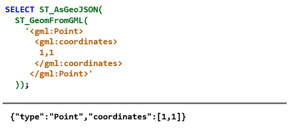


---
Exercice : Calculer la superficie d'un quartier

🛠️ Exercice : Quelle est la superficie du quartier "West Village" ?
📋 Instructions : Google + CHatGPT + https://postgis.net/docs/ST_Area.html
⏱️ Durée estimée : 10 minutes


---


Exercice : Calculer la longueur d'une rue

🛠️ Exercice : Quelle est la longueur de la rue "Pelham St" ?
📋 Instructions : Utilisez la documentation PostGIS, notamment la fonction [ST_Length](https://postgis.net/docs/ST_Length.html), pour écrire une requête SQL qui calcule la longueur de "Pelham St" dans la table des rues importée.
⏱️ Durée estimée : 10 minutes

---


Exercice : Obtenir la représentation GeoJSON d'une station

🛠️ Exercice : Quelle est la représentation GeoJSON de la station de métro "Broad St" ?
📋 Instructions : Utilisez la fonction [ST_AsGeoJSON](https://postgis.net/docs/ST_AsGeoJSON.html) de PostGIS pour écrire une requête SQL qui retourne la géométrie de la station "Broad St" au format GeoJSON.
⏱️ Durée estimée : 5 minutes


---

Exercice : Calculer la longueur totale des rues de New York

🛠️ Exercice : Quelle est la longueur totale des rues (en kilomètres) de la ville de New York ?
📋 Instructions : Utilisez la fonction [ST_Length](https://postgis.net/docs/ST_Length.html) pour additionner la longueur de toutes les rues dans la table des rues importée. 
⏱️ Durée estimée : 5 minutes


---


Exercice : Trouver la station de métro la plus à l'ouest

🛠️ Exercice : Quelle est la station de métro la plus à l'ouest ?
📋 Instructions : Utilisez la fonction [ST_X](https://postgis.net/docs/ST_X.html) pour extraire la longitude des stations et trouvez celle ayant la valeur la plus faible (la plus à l'ouest).
⏱️ Durée estimée : 5 minutes


---

## Relations spatiales : calcul de distances

PostGIS propose plusieurs fonctions pour mesurer la distance entre objets géographiques :

```sql
-- Distance euclidienne (plan)
SELECT ST_Distance(geom1, geom2);

-- Distance sphérique (terre sphérique)
SELECT ST_DistanceSphere(geom1, geom2);

-- Distance sphéroïdale (terre ellipsoïdale)
SELECT ST_DistanceSpheroid(geom1, geom2, 'SPHEROID["WGS 84",6378137,298.257223563]');
```
---

Exemple pratique :

```sql
SELECT p1.name, p2.name,
   ST_DistanceSphere(p1.the_geom, p2.the_geom) AS st_distance_sphere
FROM cities AS p1, cities AS p2
WHERE p1.id > p2.id;
```

| name            | name            | st_distance_sphere |
|-----------------|-----------------|--------------------|
| London, Ontario | London, England | 5875766.85         |
| East London, SA | London, England | 9789646.97         |
| East London, SA | London, Ontario | 13892160.95        |


---

Les base de données spatiales fournissent des requêtes spatiales


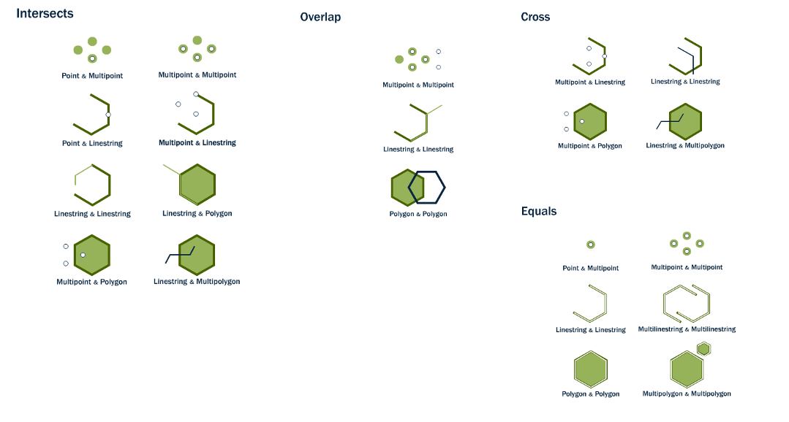

Source : http://postgis.net/workshops/postgis-intro/spatial_relationships.html

---


## Fonctions de relations spatiales principales

```sql
-- Intersections
SELECT ST_Intersects(geomA, geomB);

-- Intersection géométrique
SELECT ST_Intersection(geomA, geomB);

-- Inclusion
SELECT ST_Within(geomA, geomB);

-- Contient
SELECT ST_Contains(geomA, geomB);


-- Chevauchement
SELECT ST_Overlaps(geomA, geomB);

```

---

```sql

-- Toucher
SELECT ST_Touches(geomA, geomB);


-- Égalité géométrique
SELECT ST_Equals(geomA, geomB);
```

- Ces fonctions permettent de comparer des objets spatiaux et de filtrer selon leurs relations (intersection, inclusion, contact, etc.).
- Disponibles pour les types `geometry` et `geography`.
- Très utilisées pour les requêtes spatiales avancées (ex: trouver les objets qui se touchent ou s’intersectent).

---

Exercice : Requêtes spatiales sur la station "Broad Street"

🛠️ Exercice : 
Q1 : Quel est le well-known text (WKT) de la station de métro Broad Street ?  
Q2 : Quel quartier croise cette station de métro ?

📋 Instructions :  
- Pour Q1, utilisez la fonction [ST_AsText](https://postgis.net/docs/ST_AsText.html) pour obtenir la géométrie WKT de la station "Broad Street".
- Pour Q2, utilisez la fonction [ST_Intersects](https://postgis.net/docs/ST_Intersects.html) pour trouver le quartier dont la géométrie intersecte celle de la station "Broad Street".

⏱️ Durée estimée : 10 minutes

---

Exercice : Trouver les rues à proximité de la station "Broad Street"

🛠️ Exercice :  
Quelles sont les rues situées à moins de 10 mètres de la station de métro "Broad Street" ?

📋 Instructions :  
- Utilisez la fonction [ST_DWithin](https://postgis.net/docs/ST_DWithin.html) pour sélectionner les rues dont la géométrie est à moins de 10 mètres de la géométrie de la station "Broad Street".
- Vous devrez probablement faire une jointure entre la table des rues et celle des stations de métro.

⏱️ Durée estimée : 10 minutes

---

Exercice : Localiser un point dans un quartier et un arrondissement

🛠️ Exercice :  
Dans quel quartier et arrondissement se trouve le point `POINT(586782 4504202)` ?

📋 Instructions :  
- Utilisez la fonction [ST_Intersects](https://postgis.net/docs/ST_Intersects.html) ou [ST_Within](https://postgis.net/docs/ST_Within.html) pour déterminer dans quel quartier et arrondissement ce point se situe.


⏱️ Durée estimée : 10 minutes

---
Exercice : Calculer la distance entre deux stations

🛠️ Exercice :  
À quelle distance se trouvent "Columbus Cir" et "Fulton Ave" ?

📋 Instructions :  
- Utilisez la fonction [ST_Distance](https://postgis.net/docs/ST_Distance.html) ou [ST_DistanceSphere](https://postgis.net/docs/ST_DistanceSphere.html) pour calculer la distance entre les géométries des stations "Columbus Cir" et "Fulton Ave".
- Écrivez une requête SQL qui sélectionne ces deux stations et calcule la distance entre elles.

⏱️ Durée estimée : 5 minutes


---

## Jointures spatiales

Les jointures spatiales permettent de relier des tables en fonction de la relation géographique entre leurs objets, plutôt que sur une clé classique.

- Exemple : associer chaque station de métro au quartier dans lequel elle se trouve.

```sql
SELECT s.name AS station, q.name AS quartier
FROM stations s
JOIN quartiers q
   ON ST_Within(s.geom, q.geom);
```

- Fonctions courantes : `ST_Within`, `ST_Intersects`, `ST_DWithin`, etc.
- Très utile pour croiser des couches géographiques (ex : points dans polygones, lignes traversant polygones).

---

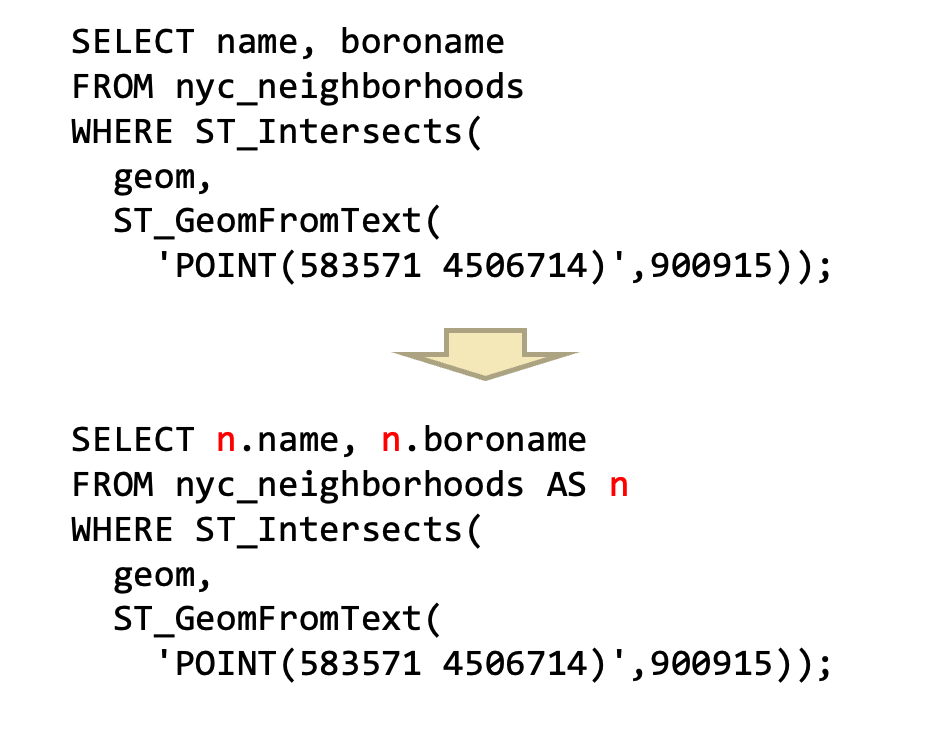


---

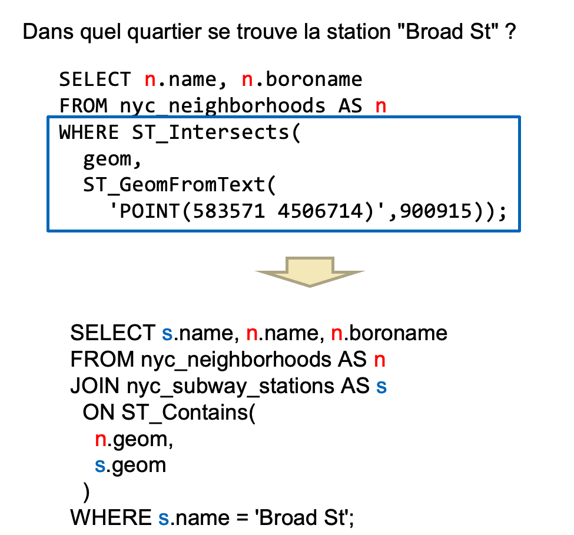

---

Exercice : Trouver la station de métro dans "Little Italy" et sa ligne

🛠️ Exercice :  
Quelle station de métro se trouve dans le quartier "Little Italy" ? Sur quelle ligne de métro se trouve-t-elle ?

📋 Instructions :  
- Utilisez une jointure spatiale entre la table des stations de métro et celle des quartiers pour identifier la station située dans "Little Italy" (`ST_Within` ou `ST_Intersects`).
- Faites une jointure avec la table des lignes de métro pour déterminer sur quelle ligne se trouve cette station.

⏱️ Durée estimée : 10 minutes


---

## Exercice : Analyse spatiale et données attributaires

🛠️ Exercice :  
Après le 11 septembre, le quartier de Battery Park a été interdit d'accès pendant plusieurs jours. Combien de personnes ont dû être évacuées ?

📋 Instructions :  
- Identifiez le quartier "Battery Park" dans la table des quartiers.
- Recherchez le champ correspondant à la population (par exemple `population` ou similaire).
- Écrivez une requête SQL pour obtenir le nombre d'habitants à évacuer.

⏱️ Durée estimée : 5 minutes

---

Exercice : Trouver le quartier avec la plus forte densité de population

🛠️ Exercice :  
Quel quartier a la plus forte densité de population (personnes/km²) ?

📋 Instructions :  
- Identifiez les champs correspondant à la population et à la géométrie des quartiers.
- Utilisez la fonction [ST_Area](https://postgis.net/docs/ST_Area.html) pour calculer la superficie de chaque quartier.
- Calculez la densité en divisant la population par la superficie (en km²).
- Écrivez une requête SQL pour trouver le quartier ayant la densité maximale.

⏱️ Durée estimée : 10 minutes


---

## Systèmes de coordonnées géographiques

- Un **système de coordonnées** permet de localiser précisément des objets dans l’espace.
- Deux grands types :
   - **Cartésien (plan)** : coordonnées (X, Y), utilisées pour des plans locaux ou des projections planes.
   - **Sphérique (géodésique)** : coordonnées (longitude, latitude, éventuellement altitude), adaptées à la surface de la Terre.
- Le choix du système de coordonnées influence la précision des mesures spatiales (distances, surfaces, etc.).
- En base de données spatiale, chaque géométrie est associée à un **SRID** (Spatial Reference System Identifier) qui définit son système de coordonnées.

---

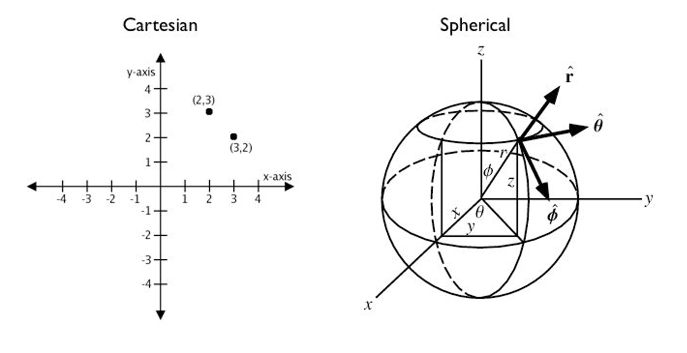

---


## Calculer la distance entre Los Angeles et Paris

Quelle est la distance entre Los Angeles et Paris en utilisant `ST_Distance(geometry, geometry)` ?

```sql
SELECT ST_Distance(
   'SRID=4326;POINT(-118.4079 33.9434)'::geometry,
   'SRID=4326;POINT(2.5559 49.0083)'::geometry
);
```

Résultat (en degrés) : **121.90**

---


Pour obtenir la distance en mètres (sur la sphère) :

```sql
SELECT ST_DistanceSphere(
   'SRID=4326;POINT(-118.4079 33.9434)'::geometry,
   'SRID=4326;POINT(2.5559 49.0083)'::geometry
);
```

Résultat : **9105587.6 mètres** (~9106 km)

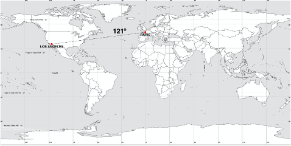


---

## Les unités de mesure spatiales

- Les **degrés** (°) ne sont pas des unités de distance ou de surface, mais des unités angulaires.
- La distance représentée par 1° de longitude varie selon la latitude :  
   - À l’équateur : ~111,3 km  
   - À 60° de latitude : ~55,8 km
- Pour obtenir des distances ou surfaces réelles, utilisez des fonctions adaptées (`ST_DistanceSphere`, `ST_Area` avec projection métrique).
- Toujours vérifier le **SRID** et le système de coordonnées de vos données avant de faire des calculs spatiaux.


---
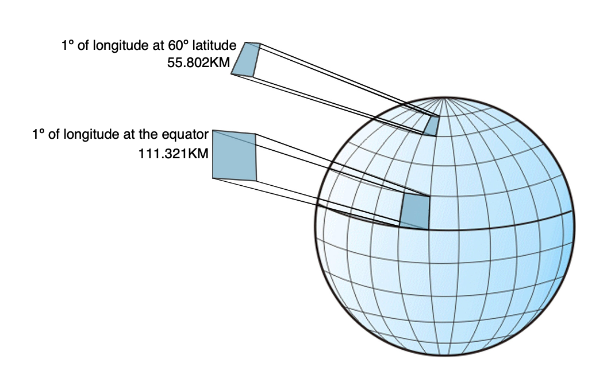


---

## Exercice : Calcul de distance entre deux villes (Los Angeles et Paris)

Quelle est la distance entre Los Angeles et Paris en utilisant `ST_Distance(geography, geography)` ?

```sql
SELECT ST_Distance(
   -- Los Angeles (LAX)
   'SRID=4326;POINT(-118.4079 33.9434)'::geography,
   -- Paris (CDG)
   'SRID=4326;POINT(2.5559 49.0083)'::geography
);
```

Résultat : **9124665 mètres** (~9125 km)

---


- La fonction `ST_Distance` appliquée à des objets de type `geography` retourne la distance sphéroïdale en mètres.
- Pratique pour des calculs de distances réelles à l’échelle mondiale.

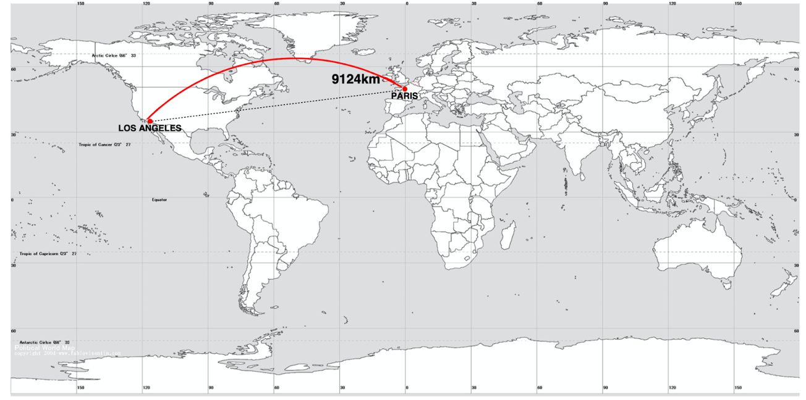

---


# Quel est l'itinéraire le plus court de Los Angeles à Tokyo ?

```sql
-- Distance en degrés (plan)
SELECT ST_Distance(
   'SRID=4326;POINT(-118.408 33.943)'::geometry, -- LAX
   'SRID=4326;POINT(139.733 35.567)'::geometry   -- NRT
);

-- Distance sphéroïdale en mètres (terre)
SELECT ST_Distance(
   'SRID=4326;POINT(-118.408 33.943)'::geography, -- LAX
   'SRID=4326;POINT(139.733 35.567)'::geography   -- NRT
);
```

---
- Avec `geometry`, la distance est calculée sur un plan (en degrés).
- Avec `geography`, la distance est calculée sur la sphère (en mètres), ce qui correspond à la distance réelle la plus courte (orthodromie).


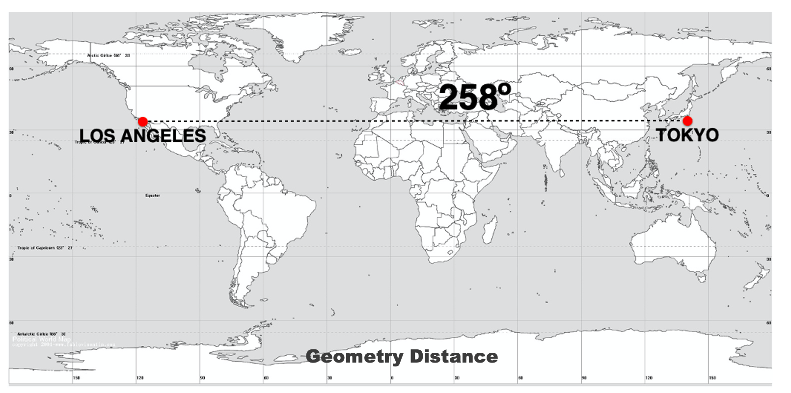


---

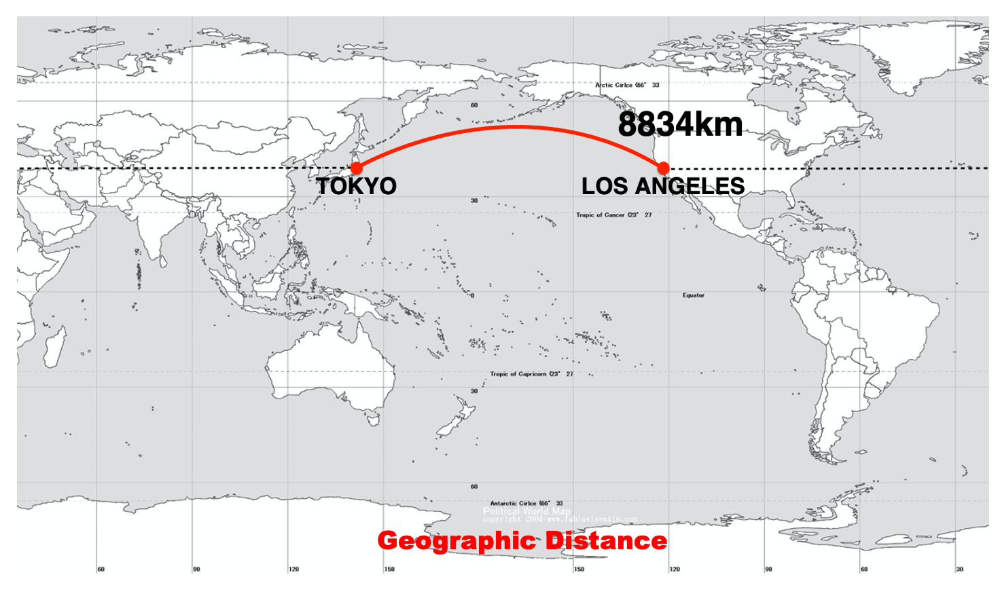

---

# Conclusion — Partie 5

- Les bases de données spatiales permettent de stocker, interroger et analyser efficacement des données géographiques.
- PostGIS enrichit PostgreSQL avec des types, fonctions et index spatiaux puissants.
- Les concepts avancés (jointures spatiales, projections, conversions de formats) sont essentiels pour des analyses précises et reproductibles.
- La maîtrise de ces outils ouvre la voie à des applications SIG avancées, collaboratives et évolutives.


---


### 5. Ressources supplémentaires
- Documentation PostgreSQL : [https://www.postgresql.org/docs/](https://www.postgresql.org/docs/)
- Documentation PostGIS : [https://postgis.net/documentation/](https://postgis.net/documentation/)
- Tutoriels PgAdmin : [https://www.pgadmin.org/docs/](https://www.pgadmin.org/docs/)


