<!-- .slide: class="stack" -->
# OPEN SOURCE GEONINJAS  MADE IN  SWITZERLAND

### we l[i|o]ve open source.

<!-- .slide: class="stack" -->

# POURQUOI QFIELD?

### parce que les données sont hors du bureau.

<!-- .slide: class="stack" -->

# QU'EST-CE QUE QFIELD?

--v--

<!-- .slide: class="stack" -->

## QU'EST-CE QUE QFIELD?

#### L'application mobile de collecte de données pour QGIS

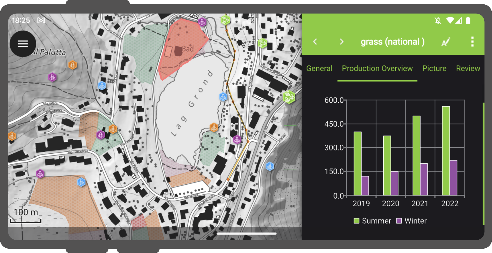

--v--

<!-- .slide: class="stack" -->

## QU'EST-CE QUE QFIELD?

#### Interface utilisateur minimaliste

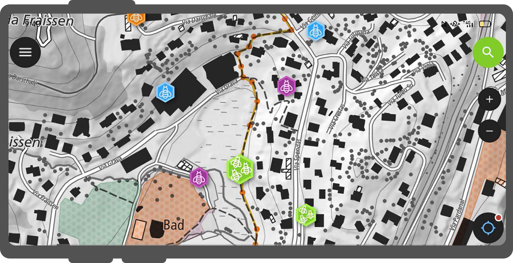

--v--

<!-- .slide: class="stack" -->

## QU'EST-CE QUE QFIELD?

#### Une cartographie magnifique

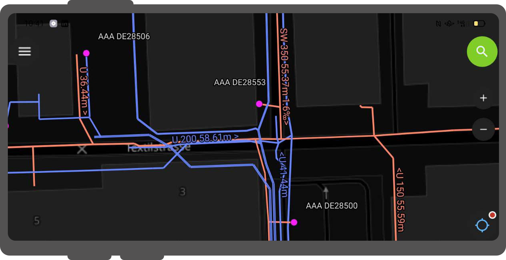

--v--

<!-- .slide: class="stack" -->

## QU'EST-CE QUE QFIELD?

#### Des outils puissants

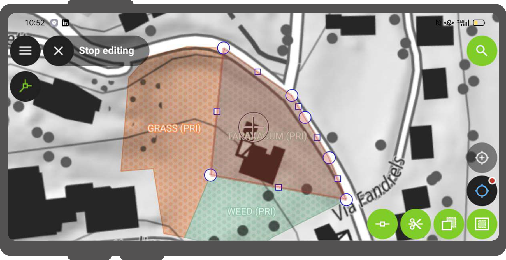

--v--

<!-- .slide: class="stack" -->

## QU'EST-CE QUE QFIELD?

#### Une interaction efficace

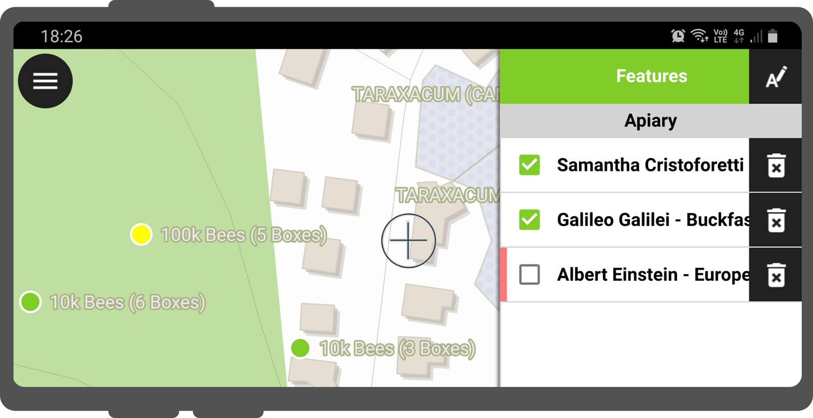

--v--

<!-- .slide: class="stack" -->

## QU'EST-CE QUE QFIELD?

#### Des intégrations avantageuses

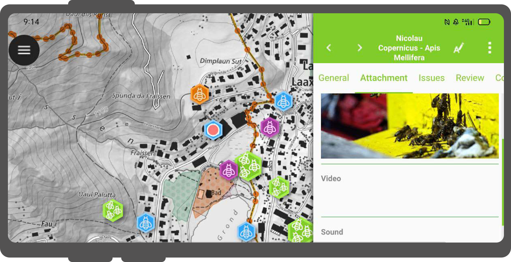

--v--

<!-- .slide: class="stack" -->

## QU'EST-CE QUE QFIELD?

#### Un matériel professionnel

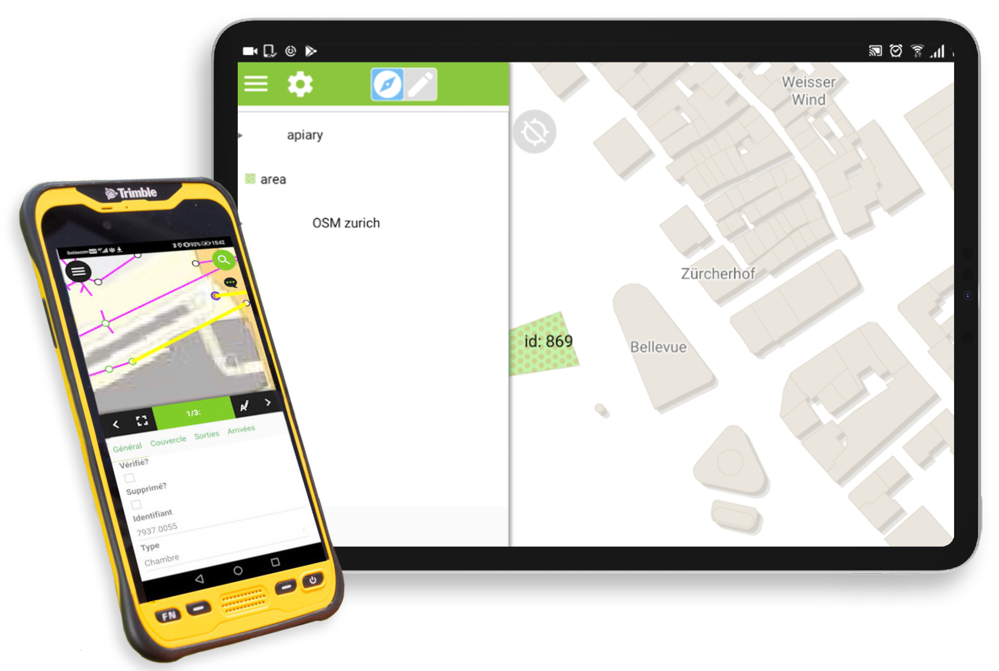

<!-- .slide: class="stack" -->

# PLATEFORMES SUPPORTÉES

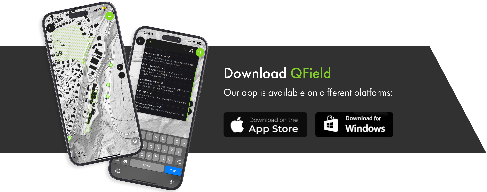

<!-- .slide: class="stack" -->

# NOTRE HISTOIRE

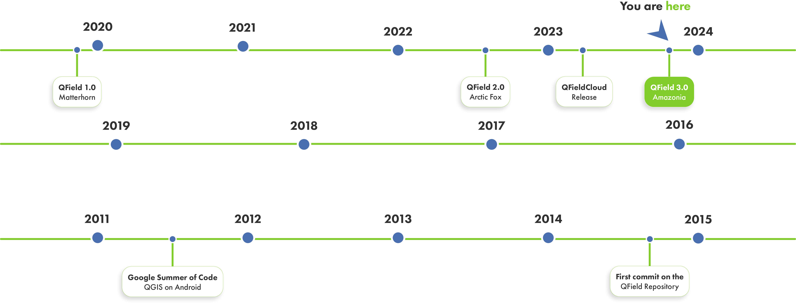

--v--

<!-- .slide: class="stack" -->

# NOTRE HISTOIRE

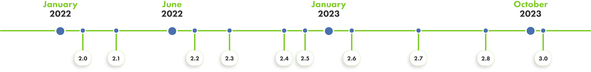

<!-- .slide: class="stack" -->

# GPS, SUIVI ET NAVIGATION

--v--

<!-- .slide: class="stack" -->

## GPS, SUIVI ET NAVIGATION

#### Intégration GNSS haute précision

<ul class="custom-bullet-list">
  <li>Bluetooth</li>
  <li>UDP</li>
  <li>TCP</li>
  <li>Port série (USB)</li>
  <li>Interne</li>
</ul>

--v--

<!-- .slide: class="stack" -->

## GPS, SUIVI ET NAVIGATION

#### Positionnement subcentimétrique

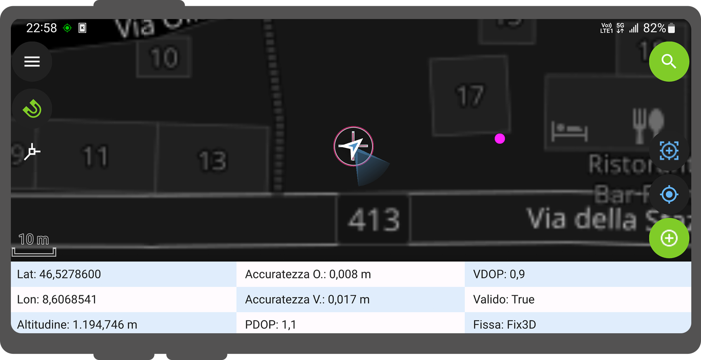

--v--

<!-- .slide: class="stack" -->

## GPS, SUIVI ET NAVIGATION

#### Moyenne de position

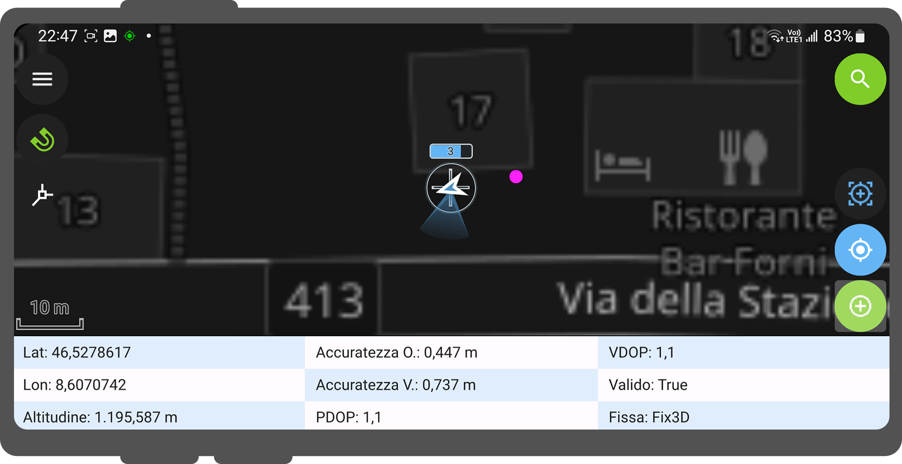

--v--

<!-- .slide: class="stack" -->

## GPS, SUIVI ET NAVIGATION

#### L'IMU change la donne

--v--

<!-- .slide: class="stack" -->

## GPS, SUIVI ET NAVIGATION

#### Suivi

<video alt="suivi" class="styled-video" controls="controls;">
<source src="assets/tracking.mp4" type="video/mp4"/>
</video>

--v--

<!-- .slide: class="stack" -->

## GPS, SUIVI ET NAVIGATION

#### Définir une entité comme destination

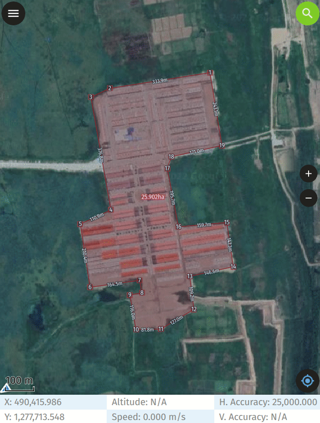

--v--

<!-- .slide: class="stack" -->

## GPS, SUIVI ET NAVIGATION

#### Implantation avec vue précise

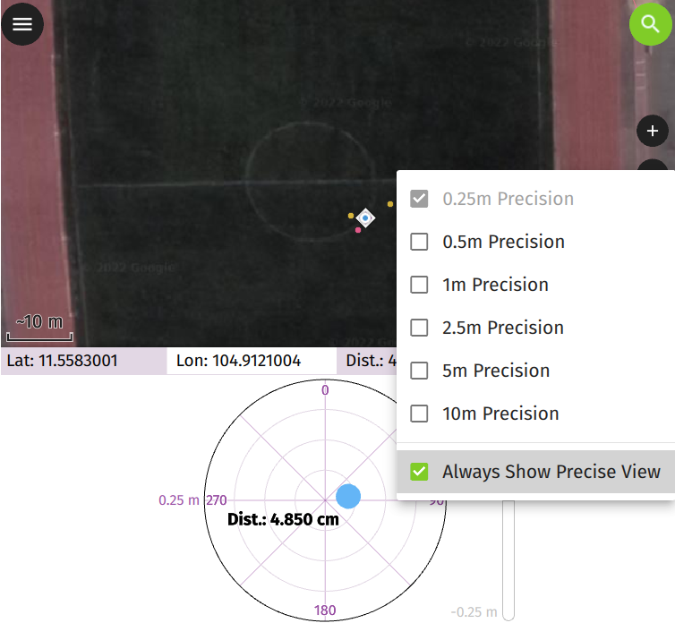

<!-- .slide: class="stack" -->

# CAPTEURS EXTERNES

--v--

<!-- .slide: class="stack" -->

## CAPTEURS EXTERNES

#### Exemple de capteur Geiger

<video controls="controls" class="styled-video">
<source src="assets/sensors.mp4" type="video/mp4" width="30%"/>
</video>

--v--

<!-- .slide: class="stack" -->

## CAPTEURS EXTERNES

#### Lecteur de code QR et NFC

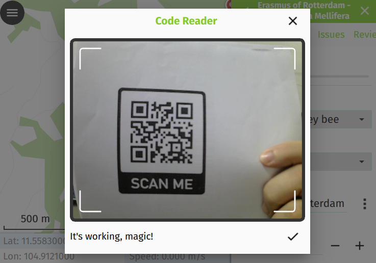

<!-- .slide: class="stack" -->

# AUTRES FONCTIONNALITÉS

--v--

<!-- .slide: class="stack" -->

## AUTRES FONCTIONNALITÉS

#### Impression d'atlas

<video controls="controls" class="styled-video">
<source src="assets/print.mp4" type="video/mp4"/>
</video>

</v>

--v--

<!-- .slide: class="stack" -->

## AUTRES FONCTIONNALITÉS

#### Ouverture de jeux de données individuels

<video controls="controls" class="styled-video">
<source src="assets/opening_individual_geopdf.mp4" type="video/mp4"/>
</video>

--v--

<!-- .slide: class="stack" -->

## AUTRES FONCTIONNALITÉS

#### Profil de hauteur

<video controls="controls" class="styled-video">
<source src="assets/profile.webm" type="video/mp4" width="10%"/>
</video>

--v--

<!-- .slide: class="stack" -->

## AUTRES FONCTIONNALITÉS

#### Recherche d'attributs et de coordonnées

<video controls="controls" class="styled-video">
<source src="assets/search.mp4" type="video/mp4"/>
</video>

--v--

<!-- .slide: class="stack" -->

## AUTRES FONCTIONNALITÉS

#### Outil de mesure

<video controls="controls" class="styled-video">
<source src="assets/measuring.mp4" type="video/mp4"/>
</video>

--v--

<!-- .slide: class="stack" -->

## AUTRES FONCTIONNALITÉS

#### Mode sombre

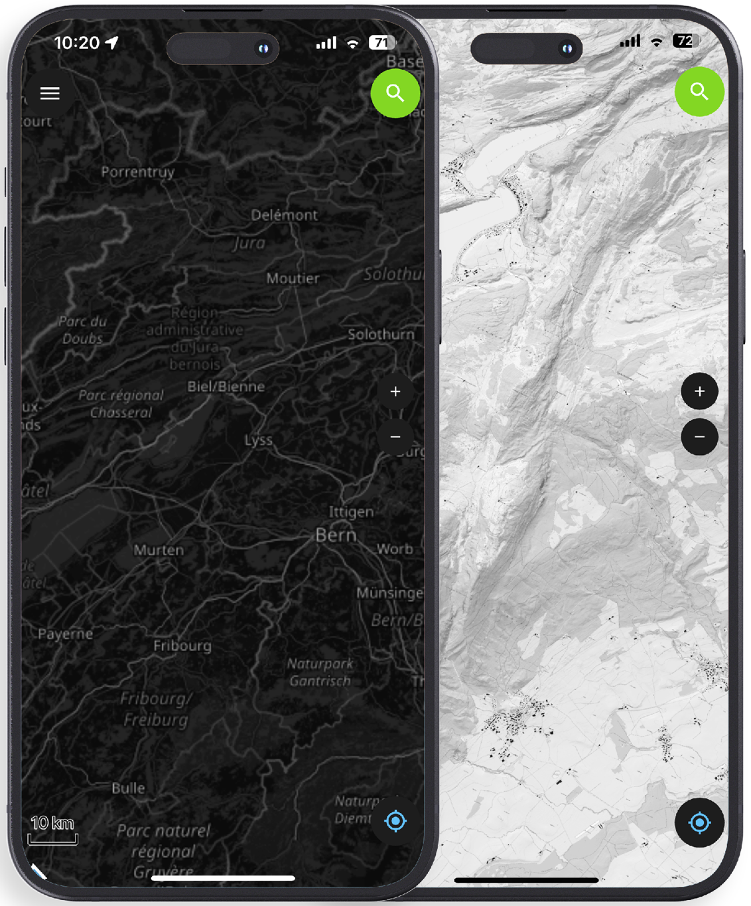
 

--v--

<!-- .slide: class="stack" -->

## AUTRES FONCTIONNALITÉS

#### Et bien d'autres...

<ul class="custom-bullet-list">
  <li>Édition et dessin de géométrie</li>
  <li>Widgets de tableau de bord (QML/HTML)</li>
  <li>Filtre temporel</li>
  <li>Rotation</li>
</ul>

--v--

<!-- .slide: class="stack" -->

## AUTRES FONCTIONNALITÉS

#### Widgets de tableau de bord (QML/HTML)

<video controls="controls" class="styled-video">
<source src="assets/qml_html.webm" type="video/mp4"/>
</video>

--v--

<!-- .slide: class="stack" -->

## AUTRES FONCTIONNALITÉS

#### Filtre temporel

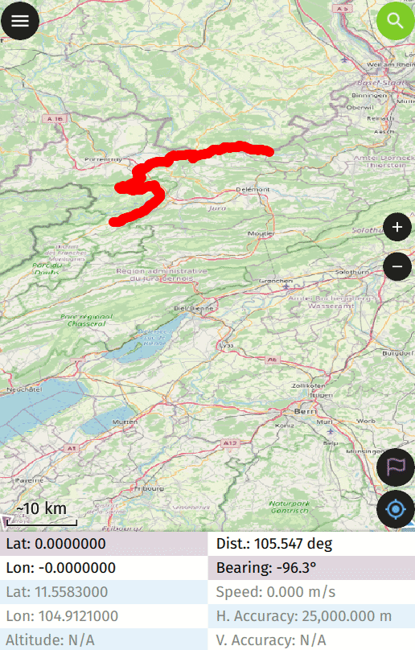

--v--

<!-- .slide: class="stack" -->

## AUTRES FONCTIONNALITÉS

#### Rotation

<video loop autoplay controls="controls" class="styled-video" width="25%">
<source src="assets/rotation.mp4" type="video/mp4"/>
</video>

<!-- .slide: class="stack" -->

# QFIELDCLOUD

### Travail de terrain fluide.  Synchronisation fluide.

--v--

<!-- .slide: class="stack" -->

## QFIELDCLOUD

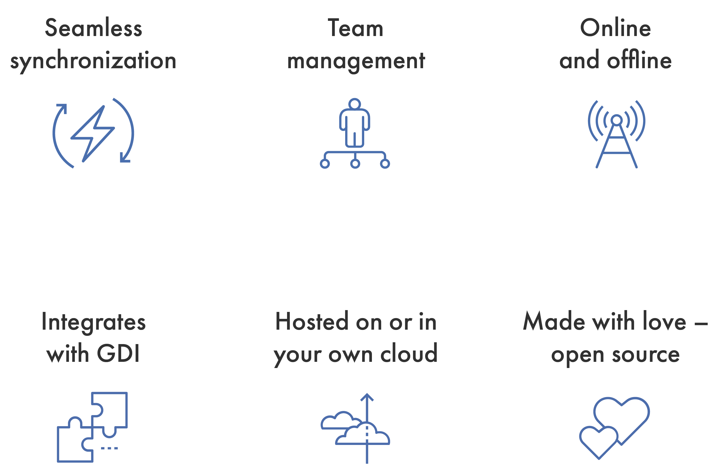

<!-- .slide: class="stack" -->

# QFIELD 3.0

<video controls="controls" class="styled-video">
<source src="assets/300001-1900.mkv" type="video/webm"/>
</video>

<!-- .slide: class="stack" -->

# MERCI ! DES QUESTIONS?

