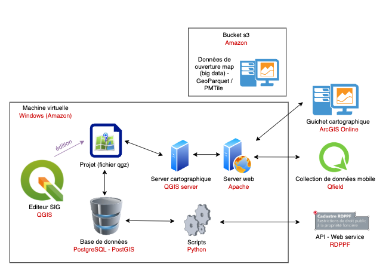

# Module S2 - SIT systèmes (webGIS et réseaux)

---

## Objectifs

- 🌟 Offrir une expérience concrète des aspects techniques du métier.  
- 💻 Permettre une première immersion dans :  
  - 🖥️ la programmation,  
  - 📊 le traitement de données,  
  - ⚙️ l’installation de logiciels,  
  - 🛠️ la gestion d’infrastructures informatiques.  

--- 

- 🎓 Mettre à profit la maturité acquise durant la formation.  
- 🤔 Se confronter à un environnement nécessitant réflexion et souplesse.  
- 🌐 Explorer l’architecture et l’intégration des SIG avec des infrastructures web et cloud.  
- 🗺️ Apprendre à gérer, publier et exploiter des données géospatiales.

---

## Mise en context 

📍 Vous allez créer un SIG qui vous permet de gérer et de publier des géodonnées.  
Ce système inclut des données du canton de Vaud, des données de la Confédération, et vous allez y ajouter des données que vous collecterez vous-même sur le terrain. Il est centré sur Yverdon.  

📋 A ce stade du projet, le client vous a dit qu'il n'avait aucune infrastructure à disposition, et qu'il vous charge de toute la mise en œuvre. Il n'a pas de cahier des charges précis, vous devez vous-mêmes concevoir et réaliser le projet.  
Le client dit que le système "devra proposer, au minimum, les fonctions de base d'un SIG standard".  

---

---

---

## La méthode de travail

🧠 Nous allons réfléchir ensemble aux éléments de conception du projet, discuter ensemble des différents sujets à aborder et à traiter dans un tel contexte.  En tant qu'experts, les enseignants mettent leur expérience à votre disposition, mais ils n'ont pas la science infuse pour autant.  

📚 Des modules théoriques devront être enseignés. Pour ceux-là, vous recevrez les slides des cours. 

📢 Les autres réflexions se feront sous la forme de discussions, et d'échanges de points de vue. Ce cours doit être interactif. Il est nécessaire que vous preniez des notes.  

🛠️ Le travail se fait de manière individuelle, car il est important que chacun ait l'occasion de faire la manipulation.  

---

## L'évaluation

📝 L'examen se déroule sous la forme écrite. Vous serez donc évalués sur des questions relatives au travail que nous avons fait ensemble en classe, et pas uniquement sur les slides présentés ni sur les modules enseignés.  

⚙️ Il est donc important que vous compreniez bien les étapes du processus

---

## Les intervenants

- **Régis Longchamp** - Infrastructure IT, Base de données, Github, Python
- **Lucie Nicolier** - QGIS desktop, QGIS Server, Qfield 
- **Eulalie Sauthier** - ArcGIS Online 

---

## Format du cours 

* 📱 **Zéro papier** : Ce cours suit une approche moderne — il n’y a **pas de support papier**. Les « slides » (qui n’en sont pas vraiment) sont disponibles sur le **dépôt GitHub** du cours.
* 🧠 **GitHub est votre ami** : Il est essentiel de vous familiariser avec GitHub. Une partie du cours y sera **consacrée**.
* 🎥 **Cours en vidéo** : Certaines parties du cours sont **enregistrées**, vous pourrez les **revoir librement** quand vous le souhaitez.
* 🤝 Soyez solidaires entre vous : les premiers peuvent aider les autres…
* 🤫 …mais faites-le dans le calme, sans que cela ne devienne un marché animé — gardons une ambiance propice à la concentration.

---

Ce cours se déroule à la fois en présentiel et à distance.

### 🎧 Prépare ton espace et ton matériel
- Assure-toi d’avoir une **connexion Internet stable**.
- Utilise si possible un **casque avec micro** pour une meilleure qualité audio.
- Trouve un **endroit calme**, bien éclairé, sans distractions.

### 💬 Reste actif·ve pendant le cours
- **Allume ta caméra**  cela aide à rester concentré·e et à créer du lien.
- **Participe** en posant des questions ou en intervenant oralement ou via le chat.
- **Note les éléments importants**, comme tu le ferais en présentiel.

---

---