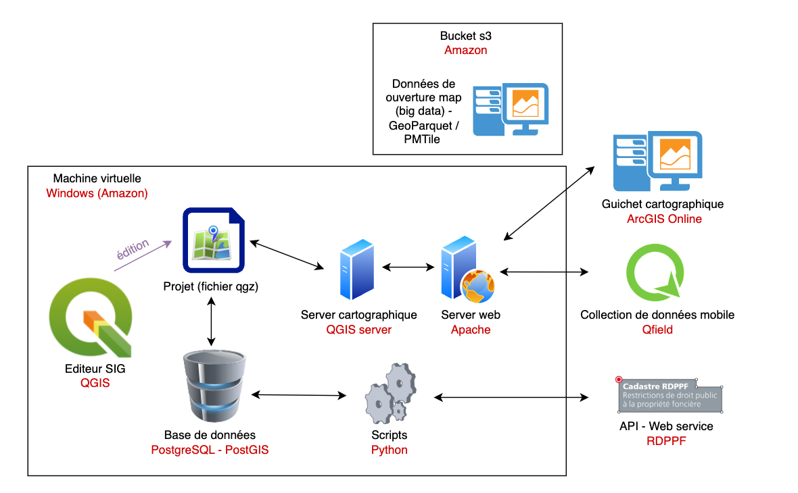

# Git et Github---## GitGit est un système de gestion de versions distribué. Il permet de suivre les modifications apportées à des fichiers et de collaborer avec d'autres personnes sur des projets.Il est particulièrement utile pour le développement de logiciels, mais peut être utilisé pour tout type de projet nécessitant un suivi des modifications.Dans le cadre de ce cours, nous n'allons **pas** utiliser Git, mais simplement GitHub comme plateforme de partage de code.---## GitHubGitHub est une plateforme de développement collaboratif qui utilise Git comme système de gestion de versions. Elle permet de stocker, partager et collaborer sur des projets de code source.GitHub offre également des fonctionnalités supplémentaires telles que la gestion des problèmes, la documentation, l'intégration continue et le déploiement.---## Fonctionnalités principales de GitHubGitHub propose plusieurs fonctionnalités pour faciliter le développement collaboratif :- **Dépôts (Repositories)** : Permettent de stocker et gérer le code source d'un projet.- **Issues** : Utilisées pour suivre les bogues, les tâches et les idées.- **Pull Requests** : Facilitent la révision et la fusion des modifications de code.- **Actions GitHub** : Permettent l'intégration continue et le déploiement automatisé.- **Pages GitHub** : Hébergent des sites web statiques directement à partir d'un dépôt.---## Les format markdownMarkdown est un langage de balisage léger qui permet de formater du texte en utilisant une syntaxe simple et lisible. Il est souvent utilisé pour rédiger des documents, des articles, des README et des commentaires sur GitHub.Il permet de créer des titres, des listes, des liens, des images et d'autres éléments de mise en forme sans avoir à utiliser du HTML complexe.Voici quelques éléments de syntaxe Markdown courants :- **Titres** : Utilisez des dièses (#) pour créer des titres de différents niveaux. Par exemple, `# Titre 1`, `## Titre 2`, `### Titre 3`.- **Listes** : Utilisez des tirets (-) ou des astérisques (*) pour créer des listes à puces. Utilisez des chiffres pour créer des listes numérotées.    - **Liens** : Utilisez la syntaxe `[texte du lien](URL)` pour créer des liens hypertextes.---- **Images** : Utilisez la syntaxe `` pour insérer des images.- **Gras et italique** : Utilisez des astérisques (*) ou des traits de soulignement (_) pour mettre du texte en gras ou en italique. Par exemple, `**gras**` ou `*italique*`.- **Code** : Utilisez des accents graves (`) pour mettre du texte en code inline. Utilisez trois accents graves pour créer des blocs de code. Par exemple, ```` ```code``` ````.- **Tableaux** : Utilisez des barres verticales (|) pour créer des tableaux. Par exemple :```| Colonne 1 | Colonne 2 ||------------|------------|| Valeur 1   | Valeur 2   |``` ---**Mais pourquoi utiliser Markdown ? Et pourquoi en parler lors de ce cours SIT ?** Lors de la première partie de ce cours, je vous ai mentionné que ce cours sera résolument moderne et orienté vers le développement.Markdown est un langage de balisage léger qui permet de formater du texte en utilisant une syntaxe simple et lisible. Il est souvent utilisé pour rédiger des documents, des articles, des README et des commentaires sur GitHub.Ces slides sont rédigées en Markdown, et vous pouvez les visualiser directement sur GitHub en format Markdown (transformé par GitHub).> Lien : [https://github.com/regislon/cfgeo_s2/blob/main/general/github.md](https://github.com/regislon/cfgeo_s2/blob/main/general/github.md)---Puis ce texte Markdown est ensuite transformé en slides à l'aide d'un outil open source intégré à GitHub. > Vous pouvez ainsi visualiser les slides à cette adresse : ---## Création d'un compte GitHubPour créer un compte GitHub, suivez ces étapes simples :1. **Accédez au site GitHub**    Rendez-vous sur [https://github.com](https://github.com).2. **Cliquez sur "Sign up"**    En haut à droite de la page d'accueil, cliquez sur le bouton **Sign up**.3. **Remplissez le formulaire d'inscription**    - **Email** : Entrez une adresse email valide.    - **Mot de passe** : Choisissez un mot de passe sécurisé.    - **Nom d'utilisateur** : Sélectionnez un nom d'utilisateur unique.    - **Préférences** : Indiquez si vous souhaitez recevoir des emails de GitHub.---4. **Vérifiez votre compte**    GitHub peut demander une vérification via un captcha ou un code envoyé à votre email.5. **Choisissez un plan**    Sélectionnez le plan gratuit pour commencer. 6. **Finalisez l'inscription**    Suivez les instructions pour configurer votre compte et commencer à utiliser GitHub.> Une fois votre compte créé, vous pourrez accéder à toutes les fonctionnalités de GitHub, comme la création de dépôts, la gestion de projets et la collaboration avec d'autres développeurs.---## Acceder au repository du cours Le repository du cours se trouve à l'adresse suivante : - https://github.com/regislon/cfgeo_s2La page web de ce repository est la suivante :- https://regislon.github.io/cfgeo_s2/🆔 Pour accéder à ces deux pages, ajouter votre identifant Github dans cette page. - <à compléter>---## Illustration : GitHub et les projets Open SourceGitHub est une plateforme essentielle pour les projets Open Source. Elle permet aux développeurs du monde entier de collaborer, partager du code et contribuer à des projets communs.Les projets Open Source sur GitHub offrent plusieurs avantages :- **Collaboration mondiale** : Les développeurs peuvent travailler ensemble, peu importe leur localisation.- **Transparence** : Le code source est accessible à tous, favorisant l'apprentissage et l'innovation.- **Contributions** : Les utilisateurs peuvent proposer des améliorations ou signaler des problèmes via des Pull Requests et des Issues.--- ## Projets Open Source en Géomatique sur GitHubGitHub héberge de nombreux projets Open Source dans le domaine de la géomatique. Voici quelques exemples notables :- **QGIS**    [https://github.com/qgis/QGIS](https://github.com/qgis/QGIS)    QGIS est un système d'information géographique (SIG) Open Source qui permet de visualiser, éditer et analyser des données géospatiales.- **GeoServer**    [https://github.com/geoserver/geoserver](https://github.com/geoserver/geoserver)    GeoServer est un serveur Open Source qui permet de partager, traiter et éditer des données géospatiales en utilisant des standards ouverts.---- **Leaflet**    [https://github.com/Leaflet/Leaflet](https://github.com/Leaflet/Leaflet)    Leaflet est une bibliothèque JavaScript légère pour créer des cartes interactives.- **PostGIS**    [https://github.com/postgis/postgis](https://github.com/postgis/postgis)    PostGIS est une extension de PostgreSQL qui ajoute le support des objets géographiques, permettant des requêtes spatiales.- **OpenLayers**    [https://github.com/openlayers/openlayers](https://github.com/openlayers/openlayers)    OpenLayers est une bibliothèque JavaScript pour afficher des cartes interactives sur le web.---- **GDAL (Geospatial Data Abstraction Library)**    [https://github.com/OSGeo/gdal](https://github.com/OSGeo/gdal)    GDAL est une bibliothèque pour la manipulation et la conversion de formats de données géospatiales.- **swisstopo**    [https://github.com/swisstopo](https://github.com/swisstopo)    swisstopo est le portail officiel de la Confédération suisse pour les données géographiques et cartographiques. Il propose des outils et des données pour la géomatique et la cartographie.- **Swiss Territorial Data Lab**    [https://github.com/swiss-territorial-data-lab](https://github.com/swiss-territorial-data-lab)    Swiss Territorial Data Lab est une initiative visant à fournir des outils et des données pour l'analyse territoriale et géospatiale en Suisse.