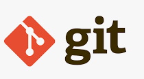
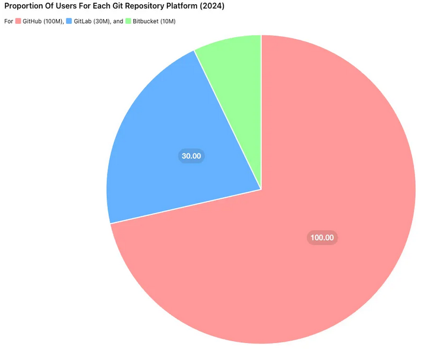
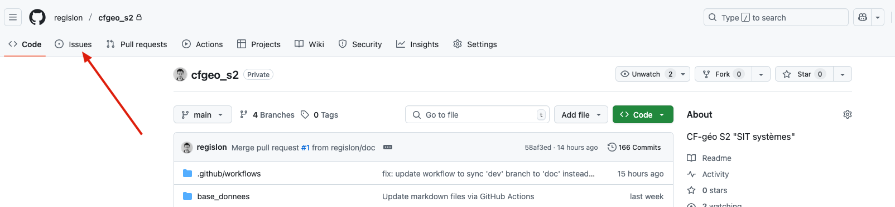

# Git et Github


- Doc : [https://github.com/regislon/cfgeo_s2/tree/main/github](https://github.com/regislon/cfgeo_s2/tree/main/github)
- Slides : [https://regislon.github.io/cfgeo_s2/github/index.html](https://regislon.github.io/cfgeo_s2/github/index.html)


## Git
Git est un système de gestion de versions distribué. Il permet de suivre les modifications apportées à des fichiers et de collaborer avec d'autres personnes sur des projets.
Il est particulièrement utile pour le développement de logiciels, mais peut être utilisé pour tout type de projet nécessitant un suivi des modifications.



Dans le cadre de ce cours, nous n'allons **pas** utiliser Git, mais simplement GitHub comme plateforme de partage de code.


## GitHub
GitHub est une plateforme de développement collaboratif qui utilise Git comme système de gestion de versions. Elle permet de stocker, partager et collaborer sur des projets de code source.
GitHub offre également des fonctionnalités supplémentaires telles que la gestion des problèmes, la documentation, l'intégration continue et le déploiement.


## Pourquoi utiliser GitHub ?





# Création de votre compte GitHub

🛠️ Exercice : Création de votre compte sur Github
📋 Instructions : créer votre compte, puis inscrire votre nom d'utilisateur sur la page de suivi : (https://chk.me/9lw684H)[https://chk.me/9lw684H]
⏱️ Durée estimée : 20 minutes


## Fonctionnalités principales de GitHub
GitHub propose plusieurs fonctionnalités pour faciliter le développement collaboratif :

- **Dépôts (Repositories)** : Permettent de stocker et gérer le code source d'un projet.
- **Issues** : Utilisées pour suivre les bogues, les tâches et les idées.
- **Pull Requests** : Facilitent la révision et la fusion des modifications de code.
- **Actions GitHub** : Permettent l'intégration continue et le déploiement automatisé.
- **Pages GitHub** : Hébergent des sites web statiques directement à partir d'un dépôt.


## Les format markdown
Markdown est un langage de balisage léger qui permet de formater du texte en utilisant une syntaxe simple et lisible. Il est souvent utilisé pour rédiger des documents, des articles, des README et des commentaires sur GitHub.
Il permet de créer des titres, des listes, des liens, des images et d'autres éléments de mise en forme sans avoir à utiliser du HTML complexe.
Voici quelques éléments de syntaxe Markdown courants :
- **Titres** : Utilisez des dièses (#) pour créer des titres de différents niveaux. Par exemple, `# Titre 1`, `## Titre 2`, `### Titre 3`.
- **Listes** : Utilisez des tirets (-) ou des astérisques (*) pour créer des listes à puces. Utilisez des chiffres pour créer des listes numérotées.    
- **Liens** : Utilisez la syntaxe `[texte du lien](URL)` pour créer des liens hypertextes.


- **Images** : Utilisez la syntaxe `` pour insérer des images.
- **Gras et italique** : Utilisez des astérisques (*) ou des traits de soulignement (_) pour mettre du texte en gras ou en italique. Par exemple, `**gras**` ou `*italique*`.
- **Code** : Utilisez des accents graves (`) pour mettre du texte en code inline. Utilisez trois accents graves pour créer des blocs de code. Par exemple, ```` ```code``` ````.
- **Tableaux** : Utilisez des barres verticales (|) pour créer des tableaux. Par exemple :
```
| Colonne 1 | Colonne 2 |
|------------|------------|
| Valeur 1   | Valeur 2   |
``` 


**Mais pourquoi utiliser Markdown ? Et pourquoi en parler lors de ce cours SIT ?** 

Lors de la première partie de ce cours, je vous ai mentionné que ce cours sera résolument moderne et orienté vers le développement.
Markdown est un langage de balisage léger qui permet de formater du texte en utilisant une syntaxe simple et lisible. Il est souvent utilisé pour rédiger des documents, des articles, des README et des commentaires sur GitHub.

Ces slides sont rédigées en Markdown, et vous pouvez les visualiser directement sur GitHub en format Markdown (transformé par GitHub).


## Accéder au repository du cours

🛠️ Exercice : Accéder au repository du cours  
📋 Instructions : Accepter l'invitation reçue  
⏱️ Durée estimée : 5 minutes


## Signaler un bug sur GitHub

GitHub permet de signaler des bugs via le système d’**Issues**. Cela facilite la communication avec les développeurs et le suivi des problèmes.




### Exemple : signaler un bug sur QGIS

Pour QGIS, la procédure officielle est détaillée ici : [https://qgis.org/resources/support/bug-reporting/](https://qgis.org/resources/support/bug-reporting/)

**Étapes générales pour signaler un bug :**
1. **Vérifier** si le bug a déjà été signalé dans la section Issues du dépôt.
2. **Créer une nouvelle Issue** si le problème n’existe pas encore.
3. **Décrire précisément le bug** 


## Fun facts : 🔧 **Git : le moteur des développeurs**

- **Créé par Linus Torvalds**
   Git a été créé en 2005 par le créateur de Linux, **Linus Torvalds**, parce qu’il était fâché contre le système de contrôle de version propriétaire BitKeeper.

- **Git signifie... Git ?**
   Linus a choisi le nom "Git" en plaisantant, car en anglais britannique, *"git"* est une insulte légère. Il a dit :

   > "I’m an egotistical bastard, and I name all my projects after myself. First ‘Linux’, now ‘Git’.”


## 🐙 **GitHub : plus qu’un hébergeur de code**

- **GitHub a été lancé en 2008**
   Et a très vite explosé en popularité parmi les développeurs open-source. Aujourd'hui, c’est **Microsoft** qui le possède (depuis 2018).

- **Le logo s’appelle Octocat**
   Ce n’est pas une pieuvre ! C’est un **chat-octopus mutant**. Son nom complet est **"Mona the Octocat"**.

- **Des millions de commits chaque jour**
   GitHub héberge **plus de 330 millions de dépôts** (2024), et des milliers de commits sont poussés chaque minute !


- **Tu peux créer un site web avec GitHub**
   Grâce à **GitHub Pages**, tu peux héberger gratuitement un site statique depuis un dépôt Git, sans rien payer.

- **NASA utilise GitHub**
   Oui, des projets comme le code du **Voyager**, ou des outils d’analyse de données spatiales y sont partagés !

- **Tu peux contribuer à l’emoji poop 💩**
   Le code source de **Unicode** (les emojis) est aussi sur GitHub. Tu peux voir les discussions autour de certains symboles célèbres !


