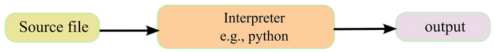
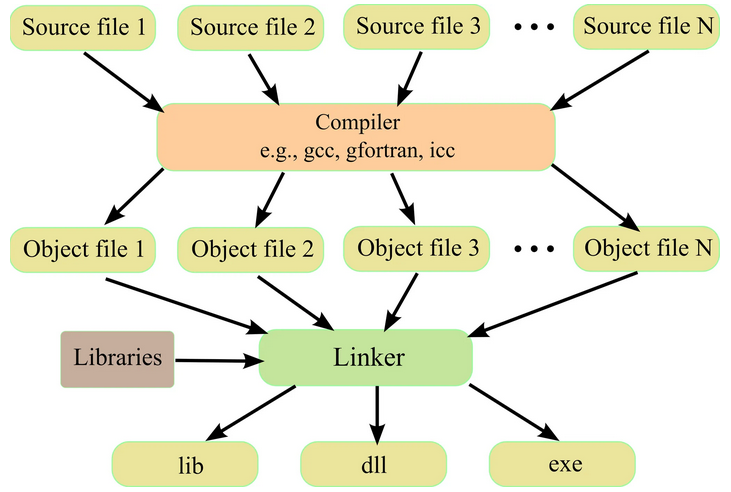

<style>
table th {
  font-size: 0.75em;
}
table td {
  font-size: 0.7em;
}
</style>

# Introduction à Jupyter Notebook
- Doc : [https://github.com/regislon/cfgeo_s2/tree/main/jupyter_notebook](https://github.com/regislon/cfgeo_s2/tree/main/jupyter_notebook)
- Slides : [https://regislon.github.io/cfgeo_s2/jupyter_notebook/readme.html](https://regislon.github.io/cfgeo_s2/jupyter_notebook/readme.html)
- PDF : [https://github.com/regislon/cfgeo_s2/blob/gh-pages/jupyter_notebook/readme.pdf](https://github.com/regislon/cfgeo_s2/blob/gh-pages/jupyter_notebook/readme.pdf)


---

# Plan

- [Introduction à Jupyter Notebook](#introduction-à-jupyter-notebook)
- [Installation de python](#installation-de-python)
- [Installation de Jupyter Notebook](#installation-de-jupyter-notebook)
- [Demonstration de Jupyter Notebook](#demonstration-de-jupyter-notebook)
- [Conclusion](#conclusion)

---

# Introduction à Jupyter Notebook


## Qu'est-ce que Jupyter Notebook ?

Jupyter Notebook est un environnement interactif qui permet d'écrire et d'exécuter du code dans plusieurs langages (Python, R, Julia, etc.). Il est particulièrement utile pour :

- L'analyse de données
- La visualisation
- Le prototypage rapide
- La documentation interactive

---


## Langage compilé vs interprété

| Langage compilé         | Langage interprété         |
|-------------------------|---------------------------|
| Le code source est transformé en un fichier exécutable par un **compilateur** avant l'exécution. | Le code source est lu et exécuté **ligne par ligne** par un **interpréteur**. |
| Exécution généralement plus rapide. | Exécution plus lente, mais plus flexible. |
| Nécessite une étape de compilation (ex : C, C++). | Pas d'étape de compilation préalable (ex : Python, JavaScript). |
| Plus difficile à déboguer (erreurs détectées à la compilation). | Plus facile à tester et à modifier rapidement. |

**Exemples :**
- Compilés : C, C++, Go, Rust
- Interprétés : Python, R, JavaScript, Ruby


---

##  Fonctionnement d'un langage compilé



Fonctionnement d'un langage interprété. Le fichier source est lu et exécuté directement par un interpréteur (par exemple Python), qui produit le résultat sans étape de compilation préalable.*


---

## Fonctionnement d'un langage interprété



Cette image illustre le processus de compilation d’un langage compilé : les fichiers source (ex. : C, C++) sont d’abord transformés en fichiers objets par un compilateur (comme gcc). Ensuite, un éditeur de liens (linker) assemble ces fichiers objets avec d’éventuelles bibliothèques pour produire un fichier exécutable (exe), une bibliothèque dynamique (dll) ou statique (lib). Ce processus se distingue des langages interprétés où le code source est exécuté directement sans étape de compilation préalable.

---


## Qu'est-ce qu'un IDE ?

Un **IDE** (Environnement de Développement Intégré) est une application qui regroupe plusieurs outils pour faciliter le développement logiciel : éditeur de code, coloration syntaxique, autocomplétion, gestion de projets, débogueur, terminal intégré, etc. Exemples populaires : PyCharm, Visual Studio Code, Eclipse.  
Un IDE vise à améliorer la productivité et le confort du développeur en centralisant toutes les fonctionnalités nécessaires au codage, à la compilation et au test d'applications.


---


## Pourquoi utiliser Jupyter Notebook plutôt qu'un IDE classique ou la ligne de commande ?

- **Interactivité** : Exécutez le code cellule par cellule et visualisez instantanément les résultats (tableaux, graphiques, images).
- **Documentation intégrée** : Mélangez facilement texte, formules mathématiques (LaTeX) et code pour créer des documents clairs et pédagogiques.
- **Exploration rapide** : Modifiez et testez des portions de code sans relancer tout le programme.

- **Visualisation avancée** : Intégrez des graphiques interactifs et des widgets pour explorer les données de façon dynamique.
- Bref, Idéal pour l'apprentissage...


---


## Prérequis

Pour utiliser Jupyter Notebook, il est recommandé d'avoir :

- **Python** installé sur votre ordinateur (version 3.7 ou supérieure).
- Un accès à un terminal (Windows, macOS ou Linux).
- Une connexion Internet pour télécharger les outils nécessaires.


---

# Installation de python

### Installation de Python

1. **Télécharger l’installateur Python 3.12.x**  
    Rendez-vous sur la page officielle : [https://www.python.org/downloads/](https://www.python.org/downloads/)

2. **Installer Python dans le répertoire `C:\Python\python-3.12.x-amd64`**  
    Lors de l’installation, choisissez le dossier d’installation `C:\Python\python-3.12.x-amd64` et cochez l’option “Add Python to PATH”.

👉 Vidéo complète de l’installation disponible [ici](https://github.com/regislon/cfgeo_s2/blob/main/python/videos/install.mkv).


---

### Installation de packages Python
Pour utiliser Jupyter Notebook, vous aurez besoin de plusieurs bibliothèques Python. Voici comment les installer :

Installation des libraries python

1. Démarrer l’invite de commande windows (taper CMD dans la barre de recherche)
    
    ```bash
    pip install ipython-sql, jupyter, psycopg2, requests, sqlalchemy psycopg2 pandas

    ```

---

## Qu'est-ce qu'un package Python ?

Un **package** (ou bibliothèque) est un ensemble de modules Python prêts à l'emploi qui ajoutent des fonctionnalités à votre environnement Python. Les packages permettent de :

- Réutiliser du code développé par d'autres (ex : manipulation de données, création de graphiques, accès à des bases de données, etc.).
- Gagner du temps en évitant de réécrire des fonctions courantes.
- Faciliter la collaboration et le partage de solutions.


Les packages s'installent généralement avec la commande `pip install nom_du_package`.

---

# Installation de Jupyter Notebook

### Option 1 : Installation autonome

1. **Installer Jupyter Notebook**  
   Ouvrez un terminal ou une invite de commande et exécutez :  
   ```bash
   pip install notebook
   ```

2. **Lancer Jupyter Notebook**  
   Dans le terminal, exécutez :  
   ```bash
   jupyter notebook
   ```
   Cela ouvrira une interface web où vous pourrez créer et gérer vos notebooks.

---

### Option 2 : Utilisation avec VS Code

1. **Installer VS Code**  
   Téléchargez et installez Visual Studio Code depuis [https://code.visualstudio.com/](https://code.visualstudio.com/).

2. **Installer l'extension Jupyter**  
   - Ouvrez VS Code.
   - Allez dans l'onglet des extensions (icône de carré en bas à gauche).
   - Recherchez "Jupyter" et installez l'extension officielle.

3. **Configurer un environnement Python**  
   - Installez Python comme décrit dans l'option 1.
   - Dans VS Code, sélectionnez un interpréteur Python (Ctrl+Shift+P → "Python: Select Interpreter").

---

4. **Créer un Notebook**  
   - Cliquez sur "File > New File" et sauvegardez-le avec l'extension `.ipynb`.
   - Vous pouvez maintenant écrire et exécuter du code directement dans VS Code.

---

# Demonstration de Jupyter Notebook

## Structure d'un Notebook

Un notebook est composé de **cellules** qui peuvent contenir :

- **Code** : pour exécuter des scripts Python ou d'autres langages.
- **Markdown** : pour ajouter des descriptions, des titres, ou des explications.
- **Sorties** : résultats des cellules de code (textes, graphiques, etc.).

---


## Exemple de Notebook

### Cellule Markdown
```markdown
# Analyse des données
Voici un exemple d'analyse avec pandas et matplotlib.
```

### Cellule Code
```python
import pandas as pd
import matplotlib.pyplot as plt
# Charger des données
data = pd.DataFrame({'x': [1, 2, 3], 'y': [4, 5, 6]})
# Tracer un graphique
plt.plot(data['x'], data['y'])
plt.show()
```

---

# Conclusion

## Conseils pour bien utiliser Jupyter Notebook

- **Organisez vos cellules** : utilisez des cellules Markdown pour structurer votre notebook.
- **Sauvegardez régulièrement** : les notebooks sont sauvegardés au format `.ipynb`.
- **Utilisez des environnements virtuels** : pour isoler vos dépendances Python.
- **Ajoutez des visualisations** : utilisez des bibliothèques comme Matplotlib, Seaborn ou Plotly.

---

## Ressources supplémentaires

- Documentation officielle Jupyter : [https://jupyter.org/documentation](https://jupyter.org/documentation)
- Extension Jupyter pour VS Code : [https://marketplace.visualstudio.com/items?itemName=ms-toolsai.jupyter](https://marketplace.visualstudio.com/items?itemName=ms-toolsai.jupyter)
- Tutoriels Python : [https://docs.python.org/3/tutorial/](https://docs.python.org/3/tutorial/)

---
