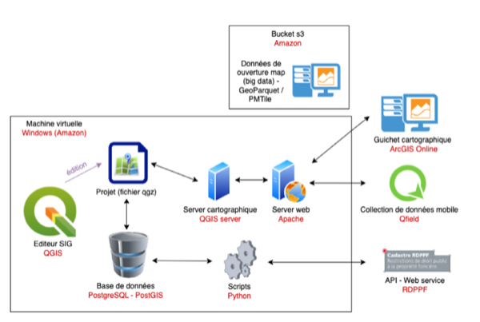
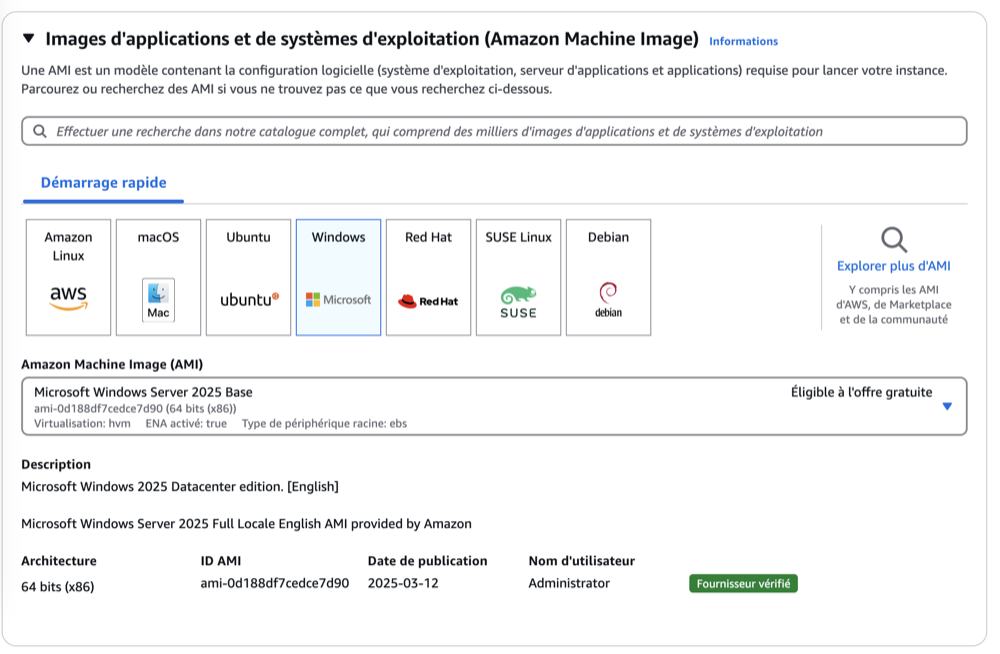
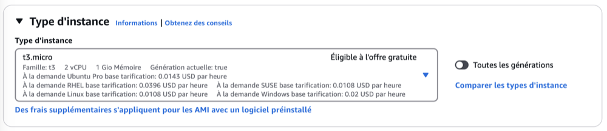
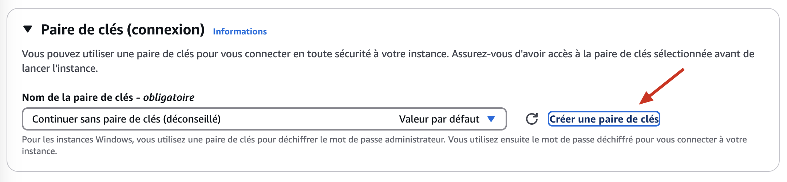
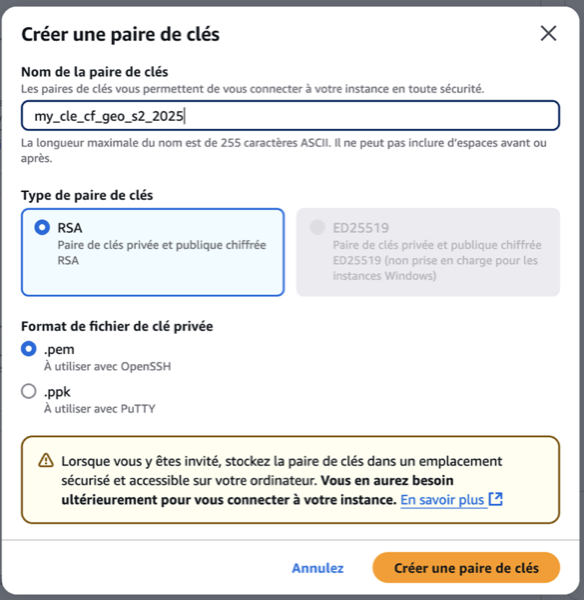
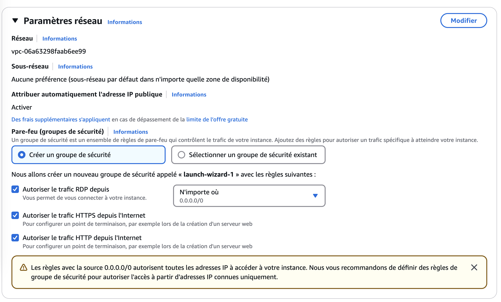
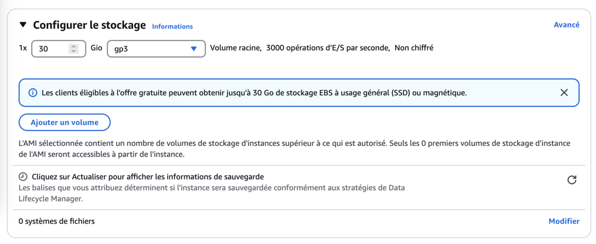

❗ Cette page est aussi publiée sous la forme d'une présentation web

# Système d'information géographique
 ---

## Définition 

Un système d’information géographique (SIG) est un outil permettant de collecter, gérer, analyser et visualiser des données géographiques pour mieux comprendre et prendre des décisions sur l’espace.

---

À votre avis, quels sont les composants d’un système d’information géographique ?

Par exemple :
- map.geoadmin.ch
- le guichet cartographique de votre canton ou commune
- celui de votre entreprise

---

Voici le schéma de notre SIG que nous allons mettre en place 🤘

---
 Cette liste présente de manière non exhaustive les différents éléments qui composent un système d'information géographique.

 

**Composants de base :**

| **Composant**                | **Rôle**                                                                 | **Exemples concrets**                              |
|------------------------------|--------------------------------------------------------------------------|----------------------------------------------------|
| **Base de données spatiale** | Stockage structuré des données géographiques et attributaires            | PostgreSQL + PostGIS, MSSQL                       |
| **Serveur d’application**    | Traitement des requêtes, logique métier                                  | Apache, NGINX, Node.js, Gunicorn                  |
| **Serveur de diffusion SIG** | Publication des couches spatiales via des services web                   | GeoServer, MapServer, QGIS Server                 |
| **Système de fichiers**      | Stockage de fichiers sources, tuiles, logs, backups                      | Amazon S3, EBS, disque local, GCS                 |
| **API / Web services**       | Points de communication entre front-end et back-end, accès aux données   | REST, WFS, WMS, WMTS, GeoJSON API                 |

---

Les composants de base d’un système d’information géographique sont installés sur un serveur (physique, virtuel ou dans le cloud), et peuvent être déployés individuellement ou sous forme de conteneurs Docker pour une installation plus rapide, modulaire et reproductible.

---
# Serveur physique
Un serveur physique est un ordinateur dédié, puissant et généralement installé dans un centre de données, conçu pour faire fonctionner des services en continu, comme une base de données, un site web ou un système d’information géographique.

---

# Serveur virtuel
Un **serveur virtuel** est une machine simulée par un logiciel (hyperviseur) qui fonctionne comme un vrai serveur, mais partage les ressources (CPU, RAM, disque) d’un serveur physique avec d'autres machines virtuelles.
> kk

---
# Serveur cloud

Un **serveur cloud** est un serveur virtuel hébergé dans un centre de données distant, accessible via Internet, et fourni à la demande par un prestataire (comme AWS, Azure ou Google Cloud), avec une grande flexibilité de ressources et de coûts.

---

<!-- .slide: style="font-size: 0.6em" -->
# Clients

Une telle infrastructure peut être utilisée par une entreprise, une administration publique ou un particulier pour gérer des données géographiques, créer des applications web, réaliser des analyses spatiales, etc.

| **Composant**                | **Rôle**                                                                 | **Exemples concrets**                              |
|------------------------------|--------------------------------------------------------------------------|----------------------------------------------------|
| **Client web**   | Interface utilisateur pour l’exploration et l’interaction avec les données | Leaflet, OpenLayers, MapLibre, React + Mapbox      |
| **Client desktop**      | Utilisation des données via un page web                                          | Qgis ArcGIS Pro    |
| **Client mobile**      | Utilisation des données via une application                                          | Qfield, ESRI Survey123   |

---

# Distinction entre le backend et le frontend

Dans le développement d'applications web ou de systèmes d'information, on distingue généralement deux parties principales :

---

## 🖥️ Front-End

Le **front-end** correspond à la partie **visible par l'utilisateur**. C'est l'interface graphique avec laquelle l'utilisateur interagit directement, via un navigateur web.

---

## 🗄️ Back-End

Le **back-end** est la partie **invisible** pour l'utilisateur. Il gère la logique métier, les calculs, les accès aux bases de données, et les communications avec le front-end.

<iframe width="560" height="315" 
src="https://www.youtube.com/embed/3aGi-5kdM9g" 
title="YouTube video player" frameborder="0" 
allow="accelerometer; autoplay; clipboard-write; encrypted-media; gyroscope; picture-in-picture" 
allowfullscreen>
</iframe>

---

## 🔁 Interaction entre Front-End et Back-End

Le front-end envoie des **requêtes** au back-end, qui traite les données et renvoie une **réponse** (souvent au format JSON).  
Cela permet de construire des applications web interactives et dynamiques.

---

# Création d'une machine virtuelle sur AWS (Amazon Web Services)

---

<!-- .slide: style="font-size: 0.6em" -->
## Étape 1 : Création de votre compte AWS

1. Rendez-vous sur le site d'AWS : [https://aws.amazon.com/fr/](https://aws.amazon.com/fr/)
2. Cliquez sur "Créer un compte AWS"
3. Renseignez votre adresse e-mail et choisissez un nom pour votre compte AWS
4. Suivez les instructions pour créer votre mot de passe
5. Sélectionnez "Compte personnel" (sauf si vous créez un compte pour une entreprise)
6. Renseignez vos informations personnelles et les détails de contact

---

## Étape 2 : Informations de paiement

1. Entrez vos informations de paiement (carte de crédit)
    > Même si vous allez utiliser des ressources gratuites, AWS demande une méthode de paiement valide
2. Validez votre identité par SMS ou appel vocal
3. Sélectionnez le plan de support gratuit (AWS Basic Support)

---

## Étape 3 : Connexion à la console AWS

1. Une fois votre compte créé, revenez sur [https://aws.amazon.com/fr/](https://aws.amazon.com/fr/)
2. Cliquez sur "Connexion à la console"
3. Connectez-vous avec l'adresse e-mail et le mot de passe que vous avez créés

---

## Étape 4 : Lancement d'une instance EC2 Windows

1. Dans la barre de recherche de la console AWS, tapez "EC2" et sélectionnez ce service
2. Cliquez sur "Lancer l'instance"
3. Donnez un nom à votre instance, par exemple "MaVMWindows"

---

## Étape 5 : Sélection de l'image (AMI)

1. Dans la section "Application and OS Images", cliquez sur l'onglet "Quick Start"
2. Sélectionnez "Microsoft Windows Server 2025 Base"
    > Assurez-vous que l'étiquette "Free tier eligible" (Éligible à l'offre gratuite) est présente

---

---

## Étape 6 : Choix du type d'instance

1. Sélectionnez le type d'instance "t3.micro" (2 vCPU, 1 Go de RAM)
    > C'est le seul type d'instance Windows éligible à l'offre gratuite AWS
2. Conservez les paramètres par défaut pour le stockage (8 Go)

---

## Étape 7 : Configuration de la paire de clés

> **Pourquoi une clé .pem ?** 
> Le fichier .pem (Privacy Enhanced Mail) contient une clé privée cryptographique qui sert à décrypter le mot de passe administrateur généré par AWS pour votre instance Windows. C'est un mécanisme de sécurité qui garantit que seule la personne possédant cette clé privée peut accéder à l'instance. Sans cette clé, il est impossible de récupérer le mot de passe administrateur et donc de se connecter à votre machine virtuelle Windows. C'est pourquoi il est crucial de conserver ce fichier dans un endroit sûr et de ne jamais le partager.

---

1. Créez une nouvelle paire de clés en cliquant sur "Create new key pair"
2. Donnez un nom à votre paire de clés, par exemple "ma-cle-windows"
3. Conservez le format .pem
4. Cliquez sur "Créer une paire de clés"
5. Le fichier de clé sera automatiquement téléchargé - conservez-le précieusement

---

---

## Étape 8 : Configuration des paramètres réseau

1. Permettez le trafic HTTP depuis n'importe où (vous pourrez ajuster cela plus tard)
2. Permettez le trafic RDP (port 3389) pour vous connecter à votre machine Windows

---

---

## Étape 9 : Lancement de l'instance

1. Vérifiez les détails de votre configuration
2. Cliquez sur "Launch instance" (Lancer l'instance)
3. Patientez quelques minutes pendant que l'instance se lance

---

## Étape 10 : Connexion à votre instance Windows

1. Retournez à la page d'accueil EC2
2. Cliquez sur "Instances" dans le menu de gauche
3. Attendez que l'état de votre instance passe à "Running" (En cours d'exécution)
4. Sélectionnez votre instance et cliquez sur "Connect" (Se connecter)
5. Choisissez l'option "RDP client" (Client RDP)
6. Cliquez sur "Get password" (Obtenir le mot de passe) et utilisez votre fichier de clé .pem
7. Téléchargez le fichier RDP et utilisez-le pour vous connecter via l'application Bureau à distance (sur windows).

---

## Connexion à votre machine virtuelle

> Le DNS (Domain Name System) est un système qui traduit les noms de domaine lisibles par les humains (comme `google.com`) en adresses IP compréhensibles par les machines (comme `142.250.74.206`). Sans le DNS, il faudrait mémoriser ces longues adresses numériques pour accéder à des sites web. 

> L’adresse publique, il s’agit de l’adresse IP attribuée à ton réseau par ton fournisseur d’accès à Internet (FAI), visible sur Internet. C’est un peu comme l’adresse postale de ta maison sur le web : elle permet aux autres ordinateurs ou services en ligne de savoir comment te joindre.

---

### 💻 Depuis Windows

1. La connexion est simple car Windows intègre déjà le client Bureau à distance (RDP)
2. Double-cliquez sur le fichier RDP téléchargé depuis la console AWS
3. Lorsque vous y êtes invité, entrez le mot de passe administrateur que vous avez obtenu avec votre fichier .pem
4. Acceptez l'avertissement de certificat si nécessaire
5. Vous êtes maintenant connecté à votre machine virtuelle Windows Server !

---

### 🍎 Depuis macOS

1. Vous devez d'abord installer un client RDP pour macOS
   * Option gratuite : Windows app (téléchargeable depuis l'App Store)
   * Alternatives : Royal TSX, Jump Desktop
2. Ouvrez l'application Windows app
3. Cliquez sur "Add PC" ou "+" pour ajouter une nouvelle connexion
4. Dans le champ "PC name", collez l'adresse DNS publique de votre instance (disponible dans la console AWS)
5. Dans "User account", sélectionnez "Add User Account" et entrez:
   * Nom d'utilisateur: `Administrator`
   * Mot de passe: collez le mot de passe que vous avez obtenu avec votre fichier .pem

--- 
### 🍎 Depuis macOS (suite)

6. Vous pouvez personnaliser l'affichage dans l'onglet "Display"
7. Cliquez sur "Save", puis double-cliquez sur la connexion créée pour vous connecter
8. Acceptez l'avertissement de certificat si nécessaire

> **Astuce**: Pour une meilleure expérience sur macOS, ajustez les paramètres d'affichage dans Microsoft Remote Desktop en augmentant la résolution et en activant le mode plein écran.

---

## Points importants à retenir

- La période d'offre gratuite dure 12 mois à partir de la création de votre compte
- Limitez-vous à 750 heures d'utilisation par mois pour rester dans l'offre gratuite (ce qui équivaut à une instance fonctionnant 24/7)
- Arrêtez votre instance quand vous ne l'utilisez pas pour économiser des heures
- Configurez des alertes de facturation pour éviter des coûts imprévus
- N'oubliez pas de supprimer les ressources dont vous n'avez plus besoin

---

## Surveillance de votre utilisation

1. Accédez à la console AWS
2. Recherchez le service "Billing" (Facturation)
3. Consultez régulièrement votre utilisation pour vous assurer de rester dans les limites de l'offre gratuite