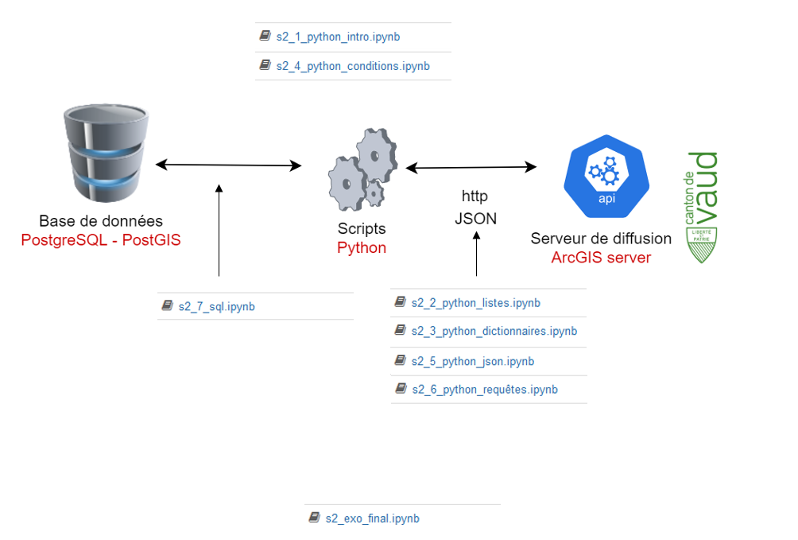
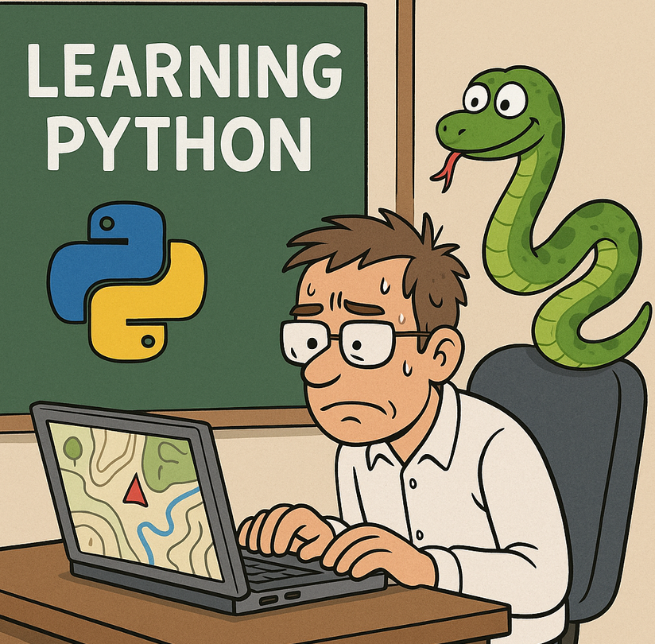

# Introduction à Python
- Doc : [https://github.com/regislon/cfgeo_s2/tree/main/python](https://github.com/regislon/cfgeo_s2/tree/main/python)
- Slides : [https://regislon.github.io/cfgeo_s2/python/readme.html](https://regislon.github.io/cfgeo_s2/python/readme.html)
- PDF : [https://github.com/regislon/cfgeo_s2/blob/gh-pages/python/readme.pdf](https://github.com/regislon/cfgeo_s2/blob/gh-pages/python/readme.pdf)

## Pourquoi apprendre Python en géomatique ?

- **Automatisation** : Python permet d'automatiser des tâches répétitives (traitement de données, conversions de formats, génération de rapports).
- **Analyse de données** : Manipulation et analyse efficace de grands volumes de données spatiales.
- **Interopérabilité** : Python s'intègre facilement avec d'autres outils et logiciels utilisés en géomatique.
- **Personnalisation** : Création de scripts et d'extensions adaptés à des besoins spécifiques.

 

Dans notre contexte, Python est particulièrement utile pour :





**Exemples de logiciels géomatiques utilisant Python :**
- **QGIS** : Scripts et plugins Python pour automatiser et étendre les fonctionnalités.
- **ArcGIS** : Utilisation de Python (ArcPy) pour le traitement spatial et la modélisation.
- **FME** : Plateforme d'intégration de données spatiales, avec support Python pour automatiser et personnaliser les traitements.
- **Revit / AutoCAD** : Possibilité d'interagir avec ces logiciels via des API Python (ex : Dynamo pour Revit, scripts Python pour AutoCAD via plugins ou outils comme pyautocad).
Apprendre Python ouvre donc de nombreuses possibilités pour un géomaticien !


 **Let's go !  🚀**


# Petite histoire de Python

- Inventé aux **Pays-Bas** au début des années 90 par **Guido van Rossum**
- Nommé d'après les **Monty Python**
- **Open Source** depuis le début
- Considéré comme un langage de script, mais il est bien plus que cela
- **Évolutif**, orienté objet et fonctionnel depuis le début
- Utilisé par **Google** dès ses débuts
- De plus en plus **populaire** dans de nombreux domaines


## À propos de ce document

Ce document présente quelques bases théoriques essentielles. Les Jupyter Notebooks associés contiennent cependant des explications et exemples plus détaillés pour approfondir votre apprentissage de Python.


# Les variables et assignation

Les variables et types de données sont les bases de la programmation Python. Elles permettent de stocker et manipuler des informations. Une bonne compréhension de ces concepts est essentielle pour créer des programmes robustes.


# Les types de données

Python propose plusieurs types de données :

- **Numbers** : `int`, `float`, `complex`
- **Boolean** : `True`, `False`
- **Sequence** : `str`, `list`, `tuple`
- **Set** : Ensemble d'éléments uniques
- **Dictionary** : Paires clé-valeur


## Les nombres

Les nombres représentent des valeurs numériques :

- **Integer** : Nombre entier (`5`, `42`)
- **Float** : Nombre décimal (`3.14`, `2.0`)

```python
diameter = 4  # int
depth = 8.6   # float
```


## Les strings

Les chaînes de caractères sont définies avec des guillemets simples ou doubles.

```python
message = "Bonjour"
print(message.upper())  # BONJOUR
```


## Les listes et tuples

- **Listes** : Ordonnées et modifiables (`[1, 2, 3]`)
- **Tuples** : Ordonnés et immuables (`(1, 2, 3)`)

```python
fruits = ['pomme', 'banane']
fruits.append('orange')  # ['pomme', 'banane', 'orange']
```


## Les dictionnaires

Les dictionnaires stockent des paires clé-valeur.

```python
mon_dict = {"nom": "Alice", "âge": 30}
print(mon_dict["nom"])  # Alice
```


# Les conditions

En Python, les conditions permettent de prendre des décisions dans le code.


## Structure de base : `if`

```python
age = 18

if age >= 18:
    print("Vous êtes majeur.")
```

Si la condition est vraie, le message sera affiché.


## `else` : Bloc alternatif

```python
age = 16

if age >= 18:
    print("Vous êtes majeur.")
else:
    print("Vous êtes mineur.")
```

Si la condition est fausse, le bloc `else` sera exécuté.


## `elif` : Vérifier plusieurs conditions

```python
note = 85

if note >= 90:
    print("Excellent")
elif note >= 80:
    print("Très bien")
elif note >= 70:
    print("Bien")
else:
    print("Peut mieux faire")
```

Chaque condition est vérifiée séquentiellement.


## Conditions multiples : `and`, `or`, `not`

```python
age = 20
permis = True

if age >= 18 and permis:
    print("Vous pouvez conduire.")
else:
    print("Vous ne pouvez pas conduire.")
```

Combinez plusieurs conditions avec des opérateurs logiques.


## Conditions imbriquées

```python
age = 20
citoyen = True

if age >= 18:
    if citoyen:
        print("Vous pouvez voter.")
    else:
        print("Vous ne pouvez pas voter.")
else:
    print("Vous êtes trop jeune pour voter.")
```

Les conditions peuvent être imbriquées pour des cas complexes.


## Conclusion

Les conditions (`if`, `elif`, `else`) et les opérateurs logiques permettent de créer des programmes interactifs et sophistiqués. Structurez-les clairement pour une meilleure lisibilité.


# Les boucles

Les boucles permettent d'exécuter une séquence d'instructions plusieurs fois. En Python, on utilise principalement les boucles `for` et `while`.


## Boucles `for`

La boucle `for` itère sur une séquence (liste, tuple, chaîne, etc.) ou une plage de nombres.

```python
values = [12, 4, 56]
for x in values:
    print(x)
```

Résultat : 
```
12
4
56
```


### Exemple : Somme des longueurs de poutres

```python
longueurs_poutres = [5.5, 7.8, 6.4]
somme_longueurs = 0

for longueur in longueurs_poutres:
    somme_longueurs += longueur

print(f"Somme des longueurs : {somme_longueurs} m")
```


### Boucler sur une plage

La fonction `range()` permet de boucler sur des entiers.

```python
for i in range(0, 5):
    print(i)
```

Résultat : 
```
0
1
2
3
4
```


## Boucles imbriquées

Les boucles imbriquées permettent de parcourir des structures multidimensionnelles.

```python
charges = [
    [2.5, 3.0],
    [4.1, 5.6]
]

total_charges = 0
for i in range(len(charges)):
    for j in range(len(charges[i])):
        total_charges += charges[i][j]

print(f"Total des charges : {total_charges} kN")
```


## Utilisation de `enumerate`

`enumerate` permet d'obtenir l'indice et la valeur dans une boucle.

```python
charges = [2.5, 3.0, 1.8]

for index, charge in enumerate(charges):
    print(f"Charge {index + 1} : {charge} kN")
```


## Boucles `while`

La boucle `while` continue tant qu'une condition est vraie.

```python
volume = 15.0  # m³
debit = 3.0    # m³/h
temps = 0

while volume > 0:
    volume -= debit
    temps += 1

print(f"Temps nécessaire : {temps} heures")
```


## Conclusion

Les boucles sont essentielles pour automatiser les tâches répétitives. Elles permettent de gérer efficacement des calculs complexes et des structures de données en Python.


# Les packages

En Python, un package est une façon d'organiser des modules Python logiquement en utilisant des dossiers et des fichiers.


## Où trouver des packages ?

- **PyPI (Python Package Index)** : Répertoire officiel de logiciels Python. Utilisez `pip` pour installer des packages.
- **GitHub et autres plateformes** : Téléchargez ou clonez des bibliothèques directement depuis des dépôts de code source.


## Est-ce gratuit ?

- **Licences open-source** : La plupart des packages sont gratuits (MIT, Apache 2.0, GPL).
- **Paquets commerciaux** : Certains nécessitent une licence payante, souvent pour des environnements d'entreprise.


## Installer des packages avec `pip`

### Vérifier l'installation de `pip`

```bash
pip --version
```

### Installer un package

```bash
pip install numpy
```

Installez facilement les bibliothèques nécessaires pour vos projets.


## Conclusion

Les packages Python permettent d'étendre les fonctionnalités de base du langage. Ils sont essentiels pour développer des projets complexes et interactifs.


# Les fonctions

Les fonctions sont des blocs de code réutilisables qui exécutent une tâche spécifique. Elles permettent de structurer le code de manière modulaire.


## Définition et Appel de Fonctions

Une fonction est définie avec le mot-clé `def` :

```python
def saluer():
    """Fonction qui affiche un message de salutation."""
    print("Bonjour tout le monde !")

# Appel de la fonction
saluer()
```


## Fonctions avec Paramètres

Les fonctions peuvent prendre des paramètres pour effectuer des opérations sur des données :

```python
def saluer_personne(nom):
    """Fonction qui salue une personne."""
    print(f"Bonjour, {nom} !")

# Appel de la fonction avec un argument
saluer_personne("Alice")
```


## Valeur de Retour

Une fonction peut renvoyer une valeur avec `return` :

```python
def addition(a, b):
    """Retourne la somme de deux nombres."""
    return a + b

# Appel de la fonction et stockage du résultat
resultat = addition(5, 3)
print(f"La somme est : {resultat}")
```


## Paramètres par Défaut

Les paramètres peuvent avoir des valeurs par défaut :

```python
def saluer_personne(nom="inconnu"):
    """Salue une personne avec un nom par défaut."""
    print(f"Bonjour, {nom} !")

# Appel sans argument
saluer_personne()

# Appel avec un argument
saluer_personne("Bob")
```


## Conclusion

Les fonctions permettent de structurer et réutiliser le code efficacement. Elles sont essentielles pour écrire des programmes modulaires et maintenables.


