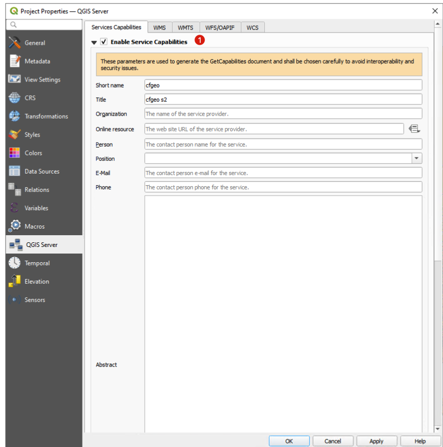
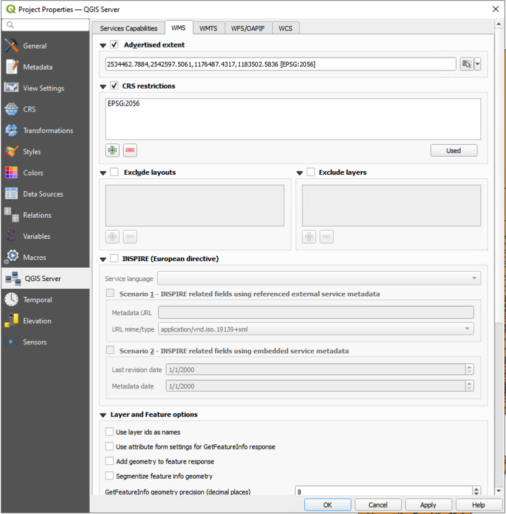

<style>
table th {
  font-size: 0.75em;
}
table td {
  font-size: 0.7em;
}
</style>


# Server Cartographique
- Doc : [https://github.com/regislon/cfgeo_s2/tree/main/serveur_cartographique](https://github.com/regislon/cfgeo_s2/tree/main/serveur_cartographique)
- Slides : [https://regislon.github.io/cfgeo_s2/serveur_cartographique/README.html](https://regislon.github.io/cfgeo_s2/serveur_cartographique/README.html)
- PDF : [https://github.com/regislon/cfgeo_s2/blob/gh-pages/serveur_cartographique/README.pdf](https://github.com/regislon/cfgeo_s2/blob/gh-pages/serveur_cartographique/README.pdf)


---


> :speech_balloon: Dans cette partie, nous allons créer un projet QGIS, le placer à l'emplacement précis sur la machine virtuelle, puis il sera servi par le serveur cartographique QGIS Server pour diffuser les données.


---


### Création de la structure du projet

- Créez un répertoire à la racine du disque nommé `qgis`.
- À l'intérieur de ce dossier, placez un projet QGIS nommé `cfgeo.qgz`.
- Cette organisation facilitera la gestion et la diffusion du projet par QGIS Server.


---

### Ajout des données au projet QGIS

- Les données ont déjà été **chargées dans la base PostgreSQL/PostGIS**.
- Créez une **connexion locale** à la base `localhost`.
- Ajoutez les couches nécessaires au projet `cfgeo.qgz`.
- Appliquez un **style minimal** (couleurs, transparence, légende) pour faciliter la diffusion via QGIS Server.

> :art: Un style clair et lisible améliore la compréhension des cartes publiées.

---


### Paramétrage du projet QGIS pour QGIS Server

- Ouvrez le menu **Project > Properties...** pour accéder aux paramètres du projet QGIS.


---


- Activez **Enable Service Capabilities** dans l’onglet `QGIS Server`.




---

- Complétez les métadonnées principales :  
  - Titre, Organisation, Contact, URL.  


- Configurez les capacités :  
  - **WMS** : étendue, options de rendu, taille max. des images.  
    


---

  - **WFS / OAPIF** : couches publiées, droits de mise à jour/insertion.  


> :bulb: Ces paramètres alimentent les documents *GetCapabilities* (interopérabilité et sécurité).  


---


## Web Map Service (WMS)

- **Norme OGC** permettant de diffuser des cartes **sous forme d’images**.  
- Principales requêtes :  
  - **GetCapabilities** : description du service.  
  - **GetMap** : génération d’une carte (image PNG/JPEG).  
  - **GetFeatureInfo** : info sur un objet en cliquant.  
- Utilisation : visualiser des couches **sans télécharger les données**.  

> :framed_picture: Exemple : afficher une carte communale en JPEG depuis QGIS Server.  


---

## Web Map Tile Service (WMTS)

- Variante de WMS qui diffuse des **tuiles prédécoupées**.  
- Avantage :  
  - Chargement rapide (cache de tuiles).  
  - Compatible avec de nombreux clients web (Leaflet, OpenLayers).  
- Principales requêtes :  
  - **GetCapabilities** : métadonnées du service.  
  - **GetTile** : récupération d’une tuile.  
  - **GetFeatureInfo** : info sur un objet (optionnel).  

> :rocket: Idéal pour les applications web nécessitant de la **performance**.  


---

## Web Feature Service (WFS)

- **Norme OGC** permettant d’accéder aux données vectorielles.  
- Diffuse les **géométries et attributs** (pas seulement une image).  
- Principales requêtes :  
  - **GetCapabilities** : description du service.  
  - **GetFeature** : récupération des objets (en GML, GeoJSON, etc.).  
  - **DescribeFeatureType** : structure des données.  
  - **Transaction (WFS-T)** : mise à jour / insertion / suppression (si autorisé).  

> :bar_chart: Permet une **analyse SIG complète côté client**.  

---

## Tester la publication du projet

- Une fois le projet QGIS paramétré, vous pouvez tester sa diffusion via QGIS Server.
- Ouvrez dans votre navigateur l’URL suivante :

```url
http://localhost/cgi-bin/qgis_mapserv.fcgi.exe?MAP=C:\qgis\cfgeo.qgz&SERVICE=WMS&VERSION=1.3.0&REQUEST=GetCapabilities
````

* Si la configuration est correcte, vous obtenez le **document XML GetCapabilities** décrivant :

  * Les couches publiées.
  * Les systèmes de coordonnées.
  * Les options disponibles pour le service WMS.

> \:mag\_right: Ce test permet de vérifier que QGIS Server **répond bien** et que votre projet est accessible.


---

## Comparaison WMS / WMTS / WFS

| Service | Diffuse quoi ? | Format de sortie | Points forts | Limites |
|---------|----------------|------------------|--------------|---------|
| **WMS** | Images (cartes rendues) | PNG, JPEG | Simple, standard, supporté partout | Moins performant, pas d’accès aux données |
| **WMTS** | Tuiles d’images | PNG, JPEG | Rapide (cache de tuiles), idéal web | Pré-découpage → moins flexible |
| **WFS** | Données vectorielles (géométries + attributs) | GML, GeoJSON, etc. | Accès aux données, analyse possible côté client | Plus lourd, performances limitées sur gros volumes |


---

## Tester l’affichage d’une couche (GetMap)

- Après le test *GetCapabilities*, on peut vérifier le rendu d’une couche précise.  
- Exemple avec la couche **`bf`** :  

```url
http://localhost/cgi-bin/qgis_mapserv.fcgi.exe?MAP=C:\qgis\cfgeo.qgz&LAYERS=bf&SERVICE=WMS&VERSION=1.3.0&REQUEST=GetMap&CRS=EPSG:2056&WIDTH=400&HEIGHT=200&BBOX=2534472,1176780,2541983,1182660
````

* Paramètres principaux :

  * **LAYERS** : nom de la couche à afficher (`bf`).
  * **CRS** : système de coordonnées (`EPSG:2056`).
  * **BBOX** : emprise de la carte.
  * **WIDTH / HEIGHT** : dimensions de l’image.

> \:framed\_picture: Le résultat est une **image générée par QGIS Server**, confirmant que la couche est bien publiée.

---


