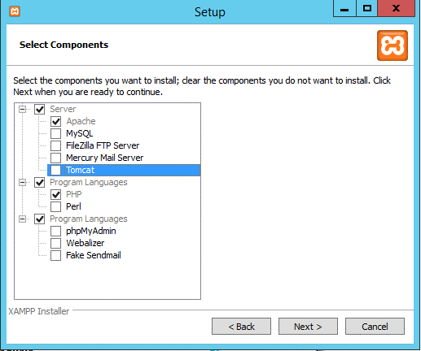
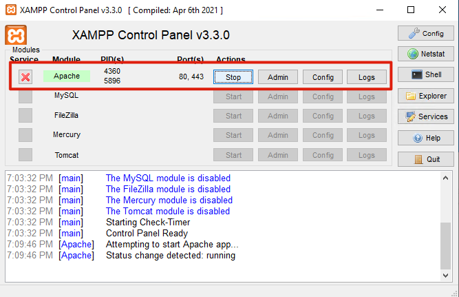
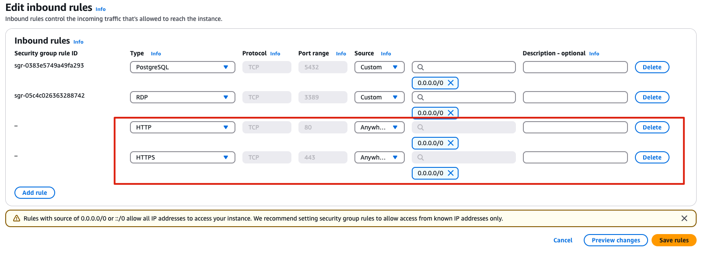

<style>
table th {
  font-size: 0.75em;
}
table td {
  font-size: 0.7em;
}
</style>


# Server Web
- Doc : [https://github.com/regislon/cfgeo_s2/tree/main/serveur_web](https://github.com/regislon/cfgeo_s2/tree/main/serveur_web)
- Slides : [https://regislon.github.io/cfgeo_s2/serveur_web/README.html](https://regislon.github.io/cfgeo_s2/serveur_web/README.html)
- PDF : [https://github.com/regislon/cfgeo_s2/blob/gh-pages/serveur_web/README.pdf](https://github.com/regislon/cfgeo_s2/blob/gh-pages/serveur_web/README.pdf)


---

### Introduction : Qu’est-ce qu’un serveur web ?

- Un **serveur web** est un logiciel qui écoute les requêtes envoyées par des clients (navigateur, QGIS, etc.)
- Il retourne des **ressources** (pages HTML, cartes, flux XML, images, etc.)
- Il utilise en général le **protocole HTTP ou HTTPS**
- Dans notre cas, il permet d’exposer un **projet QGIS** comme service **WMS / WFS**

---

### Pourquoi un serveur web dans un SIG ?

- Rendre les **données géographiques accessibles** à distance
- Permettre à des applications web ou mobiles de consommer des **flux de données cartographiques**
- Séparer le **backend SIG (QGIS Server)** de l’**interface utilisateur** (client Web, QGIS Desktop, etc.)
- Permettre l’**interopérabilité** via des standards OGC

---

### Types de serveurs web

| Type            | Logiciel              | Description courte                                 |
|------------------|------------------------|----------------------------------------------------|
| **Généralistes** | Apache, Nginx          | Gèrent les fichiers, exécutent les scripts CGI     |
| **SIG dédiés**   | QGIS Server, GeoServer | Produisent des flux WMS/WFS/WMTS à partir de SIG   |
| **Combinés**     | Apache + QGIS Server   | Requêtes traitées par Apache, transmises à QGIS    |

---

### Fonctionnement général : Apache + QGIS Server

```

[Client Web / SIG] --> [Apache HTTP Server] --> [QGIS Server] --> [Projet QGIS]

```

- Apache reçoit la requête HTTP
- Il redirige vers le fichier exécutable `qgis_mapserv.fcgi.exe`
- QGIS Server interprète la requête (ex: WMS GetMap)
- Il génère la réponse (ex: carte raster) et la renvoie

---

### Installation d'Apache

- Télécharger l'Installateur [XAMPP](https://www.apachefriends.org/download.html)
- Sélectionner uniquement que :

 

---

- Remplacer le fichier C:\xampp\apache\conf\httpd.conf par celui ci : 


> 💡 **Pourquoi remplacer `httpd.conf` ?**
>
> Le fichier `httpd.conf` par défaut **n’autorise pas** l’exécution de QGIS Server.
>
> En le remplaçant, on :
> - Active le **module CGI**
> - Crée l’alias `/cgi-bin/` vers le dossier de QGIS Server
> - Autorise l’exécution de `qgis_mapserv.fcgi.exe`
>
> ✅ Résultat : Apache peut servir les requêtes cartographiques.

---

- Ne pas oublier de redémarrer Apache à la fin de l'installation.

    

> Vidéo complète de l'installation [ici](https://github.com/regislon/cfgeo_s2/raw/main/ressources/apache/videos/install.mkv).

---


### Test du serveur web en local

- Ouvrir un navigateur **dans la machine virtuelle** (ex. Edge ou Chrome)
- Entrer l’adresse suivante dans la barre d’URL : [http://localhost](http://localhost)
- Tu devrais voir la **page d'accueil de XAMPP** (ou un fichier `index.html`)
- Si cette page s'affiche, cela signifie que **le serveur Apache fonctionne localement**


---

### Open HTTP and HTTPS ports in Windows Server 2022 firewall

1. Open **Control Panel** → **System and Security** → **Windows Defender Firewall**

2. Click on **Advanced settings** (left sidebar)

3. Select **Inbound Rules** (left)

4. In the right panel, click **New Rule...**
 
---

5. Choose:
   - **Rule Type**: *Port*
   - **Protocol**: *TCP*
   - **Specific local ports**: `80, 443`
   - **Action**: *Allow the connection*
   - **Profile**: Check all (*Domain*, *Private*, *Public*)
   - **Name**: _"Apache Web Server (HTTP/HTTPS)"_

✅ This allows incoming web traffic to reach your Apache server on ports 80 and 443.


---


### Configuration du pare-feu AWS pour autoriser l'accès externe

1. Accéder à la console AWS :  
   [console EC2 - eu-north-1](https://eu-north-1.console.aws.amazon.com/ec2/home?region=eu-north-1#Instances:)

2. Sélectionner votre **instance** dans la liste.

3. Dans l’onglet **Sécurité**, cliquer sur le **groupe de sécurité** associé.

4. Cliquer sur **Modifier les règles de trafic entrant**.

5. Ajouter les règles suivantes :
   - **Type : HTTP**, Port : `80`, Source : **n’importe quelle adresse IP** `0.0.0.0/0`
   - **Type : HTTPS**, Port : `443`, Source : **n’importe quelle adresse IP** `0.0.0.0/0`

✅ Cela permet d’accéder à votre serveur web depuis l’extérieur (navigateur, client SIG, etc.).

---

Nouveaux ajouts dans le group de sécurité :




---


### Test du serveur web depuis l’extérieur

- Depuis la **console AWS**, repère l’**adresse IPv4 publique** de ta machine
- Ouvre un navigateur **depuis ton ordinateur personnel (pas la VM)**
- Entre l’adresse suivante : `http://<votre_IP_publique>`


---


### Test de la configuration GIS server + Apache en local (sur la machine virtuelle)

Une fois QGIS server installé... 

- Placer un projet QGIS nommé "cfgeo.qgz" dans
- Depuis un navigateur web sur la machine virtuelle (Edge par exemple), entrer :  
```

localhost/cgi-bin/qgis\_mapserv.fcgi.exe?SERVICE=WMS\&VERSION=1.3.0\&REQUEST=GetCapabilities\&map=cfgeo.qgz

```
- Le test est réussi si vous obtenez une page web avec du code XML

---

### Test de la configuration GIS server + Apache en externe (depuis internet)

- Le test précédant est réussi 
- Depuis la console d'amazon, récupérer votre adresse IP publique de votre machine virtuelle. 


- Depuis un navigateur web à l'extérieur de la machine virtuelle, entrer :  
```

\<votre\_IP\_publique>/cgi-bin/qgis\_mapserv.fcgi.exe?SERVICE=WMS\&VERSION=1.3.0\&REQUEST=GetCapabilities\&map=cfgeo.qgz

```
- Le test est réussi si vous obtenez une page web avec du code XML

---
```

