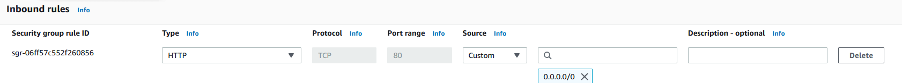

### Installation d'Apache
-  Télécharger l'Installateur [XAMPP](https://www.apachefriends.org/download.html)
- Sélectionner uniquement que :

 

- Depuis la console d'administration d'amazon, modifier le security group ainsi (ajouter cette règle): 
 

- Remplacer le fichier C:\xampp\apache\conf\httpd.conf par celui ci : 
- Ne pas oublier de redémarrer Apache à la fin de l'installation.

Vidéo complète de l'installation [ici](https://github.com/regislon/cfgeo_s2/raw/main/ressources/apache/videos/install.mkv).

### Test de la configuration GIS server + Apache en local (sur la machine virtuelle)
- Placer un projet QGIS nommé "cfgeo.qgz" dans
- Depuis un navigateur web sur la machine virtuelle (Edge par exemple), entrer :  ``localhost/cgi-bin/qgis_mapserv.fcgi.exe?SERVICE=WMS&VERSION=1.3.0&REQUEST=GetCapabilities&map=cfgeo.qgz``
- Le test est réussi si vous obtenez une page web avec du code XML

### Test de la configuration GIS server + Apache en externe (depuis internet)
- Le test précédant est réussi 
- Depuis la console d'amazon, récupérer le DNS de votre machine virtuelle. Il s'agit de l'adresse de votre machine. 

 

- Depuis un navigateur web à l'extérieur de la machine virtuelle, entrer :  ``<votre_DNS>/cgi-bin/qgis_mapserv.fcgi.exe?SERVICE=WMS&VERSION=1.3.0&REQUEST=GetCapabilities&map=cfgeo.qgz``
- Le test est réussi si vous obtenez une page web avec du code XML

