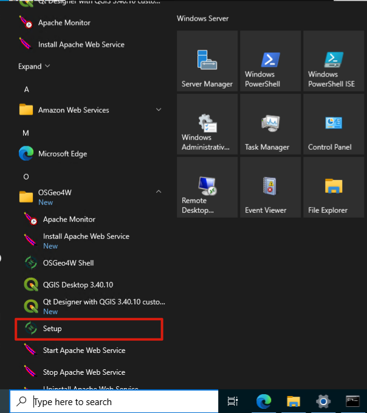
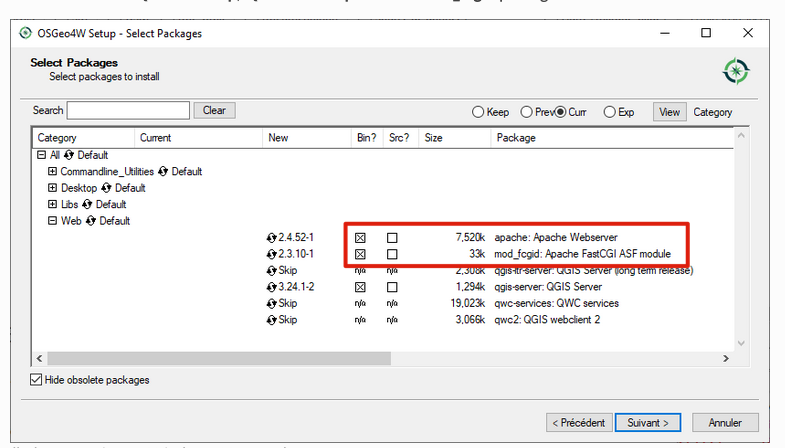
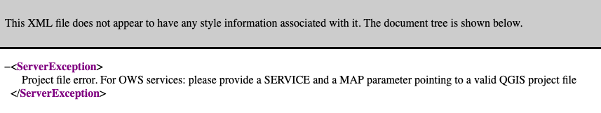

<style>
table th {
  font-size: 0.75em;
}
table td {
  font-size: 0.7em;
}
</style>


# Server Web
- Doc : [https://github.com/regislon/cfgeo_s2/tree/main/serveur_web](https://github.com/regislon/cfgeo_s2/tree/main/serveur_web)
- Slides : [https://regislon.github.io/cfgeo_s2/serveur_web/README.html](https://regislon.github.io/cfgeo_s2/serveur_web/README.html)
- PDF : [https://github.com/regislon/cfgeo_s2/blob/gh-pages/serveur_web/README.pdf](https://github.com/regislon/cfgeo_s2/blob/gh-pages/serveur_web/README.pdf)


---

### Introduction : Qu’est-ce qu’un serveur web ?

- Un **serveur web** est un logiciel qui écoute les requêtes envoyées par des clients (navigateur, QGIS, etc.)
- Il retourne des **ressources** (pages HTML, cartes, flux XML, images, etc.)
- Il utilise en général le **protocole HTTP ou HTTPS**
- Dans notre cas, il permet d’exposer un **projet QGIS** comme service **WMS / WFS**

---

### Pourquoi un serveur web dans un SIG ?

- Rendre les **données géographiques accessibles** à distance
- Permettre à des applications web ou mobiles de consommer des **flux de données cartographiques**
- Séparer le **backend SIG (QGIS Server)** de l’**interface utilisateur** (client Web, QGIS Desktop, etc.)
- Permettre l’**interopérabilité** via des standards OGC

---

### Types de serveurs web

| Type            | Logiciel              | Description courte                                 |
|------------------|------------------------|----------------------------------------------------|
| **Généralistes** | Apache, Nginx          | Gèrent les fichiers, exécutent les scripts CGI     |
| **SIG dédiés**   | QGIS Server, GeoServer | Produisent des flux WMS/WFS/WMTS à partir de SIG   |
| **Combinés**     | Apache + QGIS Server   | Requêtes traitées par Apache, transmises à QGIS    |

---

### Fonctionnement général : Apache + QGIS Server

```

[Client Web / SIG] --> [Apache HTTP Server] --> [QGIS Server] --> [Projet QGIS]

```

- Apache reçoit la requête HTTP
- Il redirige vers le fichier exécutable `qgis_mapserv.fcgi.exe`
- QGIS Server interprète la requête (ex: WMS GetMap)
- Il génère la réponse (ex: carte raster) et la renvoie

---

### Installation et parametrisation d'Apache

L'installation d'Apache s'effectue avec le OSGeo4W network installer (comme pour QGIS et QGIS serveur).

Cela s'effectue en 3 étapes :  
1. Installation via OsGeo4W
2. Configuration du fichier httpd.conf
3. Démarrage du service Apache

 --- 

#### Partie 1 : Installation via OsGeo4W

1. **Télécharger et lancer l’installateur OSGeo4W.**
  
2. **Choisir l’option « Advanced Install ».**

---

3. **Sélectionner les paquets suivants dans la catégorie web :**
  * `apache`, `qgis-ltr-server` et `mod_fcgi`.


4. **Exécuter le fichier `OSGeo4W.bat` en tant qu'administrateur** :
   - Naviguer vers le dossier `C:\OSGeo4W\`.
   - Faire un clic droit sur le fichier `OSGeo4W.bat` et sélectionner **Exécuter en tant qu'administrateur**.
   
---

5. **Installer le service Apache** :
   - Dans la console, exécuter la commande suivante :
     ```
     apache-install.bat
     ```
   - Cela affichera un message similaire :
     ```
     Installing the 'Apache OSGeo4W Web Server' service
     The 'Apache OSGeo4W Web Server' service is successfully installed.
     Testing httpd.conf....
     Errors reported here must be corrected before the service can be started.
     ```

Garder cette console ouverte, nous en auront besoin dans quelques minutes.

---


#### Partie 2 : Configuration du fichier httpd.conf

Pour configurer correctement Apache avec QGIS Server, il est nécessaire de modifier le fichier `httpd.conf` situé dans `C:\OSGeo4W\apps\apache\conf\httpd.conf`. Voici les changements à effectuer :


1. **Indiquer où trouver les fichiers de script** :
   Remplacer :
   ```
   ScriptAlias /cgi-bin/ "${SRVROOT}/cgi-bin/"
   ```
   Par :
   ```
   ScriptAlias /cgi-bin/ "C:/OSGeo4W/apps/qgis-ltr/bin/"
   ```


⚠️ Vérifie bien que le chemin C:/OSGeo4W/apps/qgis-ltr/bin/ existe !

---


2. **Fournir les permissions sur le dossier des scripts** :
   Remplacer :
   ```
   <Directory "${SRVROOT}/cgi-bin">
       AllowOverride None
       Options None
       Require all granted
   </Directory>
   ```
   Par :
   ```
   <Directory "C:/OSGeo4W/apps/qgis-ltr/bin">
       SetHandler cgi-script
       AllowOverride None
       Options ExecCGI
       Require all granted
   </Director
    ```
   
   ⚠️ Vérifie bien que le chemin C:/OSGeo4W/apps/qgis-ltr/bin/ existe !

---


3. **Activer les extensions de fichiers pour les scripts** :
   Remplacer :
   ```
   #AddHandler cgi-script .cgi
   ```
   Par :
   ```
   AddHandler cgi-script .cgi .exe
   ```

---


4. **Ajouter des variables de configuration spécifiques à OSGeo4W** :
   Ajouter à la fin du fichier :
   ```
   # parse OSGeo4W apache conf files
   IncludeOptional "C:/OSGeo4W/httpd.d/httpd_*.conf"
   SetEnv GDAL_DATA "C:/OSGeo4W/share/gdal"
   SetEnv QGIS_AUTH_DB_DIR_PATH "C:/OSGeo4W/apps/qgis-ltr/resources"
   ```

   ⚠️ Vérifie bien que le chemin C:/OSGeo4W/apps/qgis-ltr/resources existe !


---

#### Partie 3 : Démarrage du service Apache

✅ Une fois ces modifications effectuées, redémarrer Apache pour appliquer les changements. Pour ce faire, retourne dans la console OSGeo4W et entre : 

  ```
   apache-restart.bat
   ```


Puis nous pouvons tester le serveur web en local, depuis un navigateur web sur la machine virtuelle, entrer :  
```
http://localhost/cgi-bin/qgis_mapserv.fcgi.exe?SERVICE=WMS&VERSION=1.3.0&REQUEST=GetCapabilities
```
 Une page web avec un contenu XML devrait s'afficher. 🎆 

---


### Open HTTP and HTTPS ports in Windows Server 2022 firewall

1. Open **Control Panel** → **System and Security** → **Windows Defender Firewall**

2. Click on **Advanced settings** (left sidebar)

3. Select **Inbound Rules** (left)

4. In the right panel, click **New Rule...**
 
---

5. Choose:
   - **Rule Type**: *Port*
   - **Protocol**: *TCP*
   - **Specific local ports**: `80, 443`
   - **Action**: *Allow the connection*
   - **Profile**: Check all (*Domain*, *Private*, *Public*)
   - **Name**: _"Apache Web Server (HTTP/HTTPS)"_

✅ This allows incoming web traffic to reach your Apache server on ports 80 and 443.


---


### Configuration du pare-feu AWS pour autoriser l'accès externe

1. Accéder à la console AWS :  

2. Sélectionner votre **instance** dans la liste.

3. Dans l’onglet **Sécurité**, cliquer sur le **groupe de sécurité** associé.

4. Cliquer sur **Modifier les règles de trafic entrant**.

5. Ajouter les règles suivantes :
   - **Type : HTTP**, Port : `80`, Source : **n’importe quelle adresse IP** `0.0.0.0/0`
   - **Type : HTTPS**, Port : `443`, Source : **n’importe quelle adresse IP** `0.0.0.0/0`

✅ Cela permet d’accéder à votre serveur web depuis l’extérieur (navigateur, client SIG, etc.).

---

Nouveaux ajouts dans le group de sécurité :


---


### Test du serveur web depuis l’extérieur

- Depuis la **console AWS**, repère l’**adresse IPv4 publique** de ta machine
- Ouvre un navigateur **depuis ton ordinateur personnel (pas la VM)**
- Entre l’adresse suivante : `http://<votre_IP_publique>/cgi-bin/qgis_mapserv.fcgi.exe?SERVICE=WMS&VERSION=1.3.0&REQUEST=GetCapabilities`

La page devrait afficher un contenu XML avec les informations de capacité du service WMS : 




